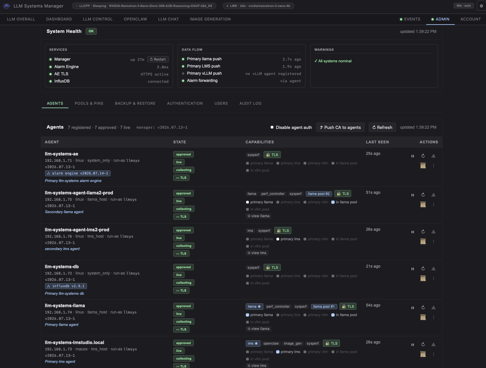

# LLM Systems Manager

A highly configurable, real-time monitoring, observability, alerting, and control system for an LLM lab

It currently integrates [llama.cpp](https://github.com/ggerganov/llama.cpp), [LM Studio](https://lmstudio.ai/), [stable-diffusion.cpp](https://github.com/leejet/stable-diffusion.cpp), and [OpenClaw](https://github.com/openclaw/openclaw) session telemetry, but the agent reports general host metrics for any Linux or macOS machine. 

New integrations with vLLM and Ollama are on the roadmap.

---


**Llama dashboard** - view real time metrics on the llama.cpp server


**Lmstudio dashboard** - view real time metrics on the lmstudio server


**Model control** — start/stop inference servers, change models, control the provider, manage the model library, run benchmarks, auto tune models.


**Openclaw dashboard** - openclaw metrics and analytics


**Manager dashboard** — view overall manager and agent health.


**Alarm engine** — trend graphs, rule and notification editor, alert timeline.


**Admin console** - agent management, user & login management, backup/restore, routing of agent tasks



---

## Highlights

- **LLM model management.** A built-in Hugging Face interface manages your model library and allows the user to download and prune individual models and files. Each model can keep multiple named **config profiles** (e.g. chat / code / general) and swap between them from the model card, activating one applies its settings and reloads the model if it's running.
- **Remote control without SSH.** The LLM control module allows the user to Restart the inference server daemons, update the llama.cpp installation, swap running models, edit and save per-model configs and profiles, run benchmarks against all of your models, autotune ctx slot counts to find the best context settings, tail logs, or open an in-browser PTY terminal to the inference server, all without leaving the page.
- **LLM runtime visibility.** Live state from `llama.cpp` (slots, tokens/sec, prompt-processing rate, KV cache, context, idle/awake) and from LM Studio (loaded models, active sessions).
- **Direct LLM chat.** Chat with the model through the embedded llama.cpp web interface.
- **OpenClaw analytics.** The manager parses session logs into token-usage, cost, and tool-attribution dashboards.
- **Image generation.** A dedicated tab optionally drives image generation software like stable-diffusion.cpp for text-to-image generation.
- **Cross-platform agents.** One agent process for Linux and macOS (Apple Silicon). Auto-detects what each host runs and enables only what's relevant. Serves its API over TLS.
- **TLS Encryption.** All Agent ↔ Manager and Agent ↔ Alarm Engine connections use TLS.
- **Live host telemetry.** CPU, RAM, disk, network, GPU utilization, PSU, UPS battery, AIO stats.
- **Alerting that survives outages.** A standalone alarm engine persists every metric to InfluxDB, evaluates threshold and anomaly rules, and routes alerts via email, toast, webhook, or Discord. Agents buffer to disk if the engine is down and replay when it returns.
- **At-a-glance system status.** A dot beside the **Events** tab turns red while any *active* critical alert is unresolved; a dot beside **Admin** turns red when system health degrades (stale/down agents, disconnected services, cert warnings). Both update on every tab.
- **Multi-agent.** Run the same provider (llama.cpp, LM Studio, …) on more than one host and a picker appears in the dashboard to switch the view and controls between agents — every approved agent is independently viewable and controllable, with one designated as the default. The **LLM Overall** tab rolls the whole fleet into one view (combined throughput, hottest GPU, total power, active models). A single-host lab sees no change; the picker only shows up once a second agent of a type is approved. Adding a brand-new provider is a one-file-per-side drop-in.
- **Multi-user access control.** Multiple named accounts with **Admin** / **Operator** roles — operators can drive the LLMs and watch dashboards but are kept out of the Admin tab, agent management, secrets, and shells. Admins create / disable / delete users and reset passwords from **Admin → Users**; every user gets self-service password change and logout from the **Account** menu, with username + source-IP lockout after repeated failed logins.


## Donations

If you find this project useful, please consider leaving a donation

<!--START_SECTION:buy-me-a-coffee-->
<a href="https://www.buymeacoffee.com/llmsystems" target="_blank"></a>
<!--END_SECTION:buy-me-a-coffee-->
---

## Quickstart — single host

For a quick installation on one host, choose the full install option:

```bash
bash <(curl -fsSL https://raw.githubusercontent.com/llmsyscore/llm-systems-manager/main/tools/installer/install.sh)
```

The installer is interactive: it prompts for SMTP credentials (if you want email alerts), the manager admin login, and confirms before installing system packages. It then enables the systemd units but **does not start anything automatically** — it prints the exact `systemctl start` commands so you stay in control of timing.

After install:

1. Start the services if they were not started at installation, the commands to start them will be shown by the installer.
2. Open `http://<this-host>:5000/` in a browser. Log in with the admin credentials you set.
3. From the **Admin** tab, approve any agents that have registered. Approval issues each agent a per-host TLS certificate and unlocks remote control.

That's it for a single-host lab. Everything else below is for adding more hosts or pointing the dashboard at inference servers you already run.

---

## Agent installation

The agent is what pushes all data into the dashboard. Run the installer and use the mode 5 (agent installation) option on every machine you want to monitor and control (Linux or macOS):

```bash
bash <(curl -fsSL https://raw.githubusercontent.com/llmsyscore/llm-systems-manager/main/tools/installer/install.sh)
```

The agent registers itself with the manager on first launch. From **Admin → Agents**, click **Approve** — the manager signs a TLS cert for that agent and starts polling it.

Approve a second agent that runs the same provider (e.g. a second `llama.cpp` box) and a host picker automatically appears on the matching dashboard sub-tabs — every approved agent is independently viewable and controllable. One agent is the *default* (what the dashboard shows when you haven't picked); set it from **Admin**.

## Multiple Hosts

Typical lab topology:

```
                ┌─────────────────────┐
                │  Manager + Alarm    │  
                │  Engine + InfluxDB  │  
                │  + local agent      │
                └──────────┬──────────┘
                           │
        ┌──────────────────┼──────────────────┐
        │                  │                  │
   ┌────▼─────┐      ┌─────▼────┐       ┌─────▼────┐
   │  GPU     │      │  Mac     │       │  Other   │
   │  host    │      │  Studio  │       │  hosts…  │
   │  agent   │      │  agent   │       │  agent   │
   │  +llama  │      │  + LMS   │       │          │
   └──────────┘      └──────────┘       └──────────┘
```

When you want the **InfluxDB on its own host**, use mode 6 (InfluxDB only) option there first, then choose mode 2 (Manager + alarm) on the manager/alarm-engine host. The installer will prompt for the InfluxDB URL and the Influxdb tokens that were printed during the InfluxDB installation.

When you want the **manager and alarm engine on separate hosts**, use mode 3 (manager only) on the manager hose and mode 4 (alarm engine) on the alarm engine host. 

The installer will prompt for the cross-host URLs and then gives you the exact commands required to copy the alarm engine's TLS certs from the manager host to the alarm engine host.

### Choosing the run-as user

By default the manager and alarm engine run as a dedicated `llmsys` system account (auto-created, password-locked). Passing `--user <name>` to the installer allows you to use a different account, you can also enter the account name during the installation as well:

If the account exists, its real primary group is preserved; if it doesn't, the installer creates it as a system user. The agent installer also accepts the same `--user` flag.

---

## Pointing the agent at your own services

The agent ships with sensible defaults and attempts to automatically configure itself. If your inference servers run on different ports, hosts, or paths, you can override them in the `agent/agent_config.yaml` file on each agent host (the installer drops a template alongside the agent). 

Common keys:

| Key | What it points at | Default |
|---|---|---|
| `LLAMA_API_URL` | Your `llama-server` HTTP endpoint | `http://localhost:8080` |
| `LMS_API_URL` | Your LM Studio API endpoint | `http://localhost:1235` |
| `LLAMA_BIN` | Path to the `llama-server` binary (only needed for the agent's auto-restart / config-edit flows) | auto-detected |
| `LLAMA_CONFIG_INI` | Path to `config.ini` driving `llama-server` | auto-detected |
| `LLAMA_LOG_FILE` | Path to `llama-server.log` (for log-tail + state detection) | auto-detected |
| `LMS_CMD` | Path to the `lms` CLI | auto-detected (`which lms`) |
| `PROCESS_WATCHLIST` | Process names the agent should report on (psutil-style) | sensible defaults — see the example |

The installer fills most of these in at deploy time via auto-detect and prompts; the file above lists what to override after installation. Any field can also be set via environment variable `LSA_<NAME>` (e.g. `LSA_LLAMA_API_URL=http://...`).

Enable only what's relevant — the agent installer offers `--enable-llama`, `--enable-lms`, and `--enable-perf` flags, and auto-detects most of these from what's installed on the host. 

A host with neither `llama-server` nor LM Studio just reports generic system metrics.

---

## Architecture

```
                              ┌────────────────────────┐
                              │       Browser          │
                              │  (single-page dash)    │
                              └───────────┬────────────┘
                                          │ HTTP / SSE / WebSocket
                                          ▼
                              ┌────────────────────────┐
                              │   Manager (Flask)      │
                              │  • UI + REST API       │
                              │  • Reverse proxies     │
                              │  • Agent registry      │
                              │  • Internal CA (mTLS)  │
                              └─┬──────────────────┬───┘
                  proxies       │                  │  forwards control
                                │                  │
                 ┌──────────────▼────────┐    ┌────▼────────────────┐
                 │   Alarm Engine        │    │  Agents (FastAPI)   │
                 │   (FastAPI)           │    │  TLS, bearer auth   │
                 │  • Ingests metrics    │◀───┤  • Host telemetry   │
                 │  • Rule evaluation    │    │  • llama / LMS ctrl │
                 │  • Notifications      │    │  • PTY + log tail   │
                 │  • WebSocket → UI     │    │  • Disk buffer      │
                 └──────────────┬────────┘    └─────────────────────┘
                                │
                       ┌────────▼─────────────┐
                       │   InfluxDB v2        │
                       │  metrics time-series │
                       │  (raw + rollups)     │
                       ├──────────────────────┤
                       │   SQLite (WAL)       │
                       │  alerts · rules ·    │
                       │  channels · history  │
                       └──────────────────────┘
```

### The three services

| Service | Role | Where it runs |
|---|---|---|
| **Manager** | Web UI, REST API, reverse proxies for sub-services, agent approval, internal certificate authority, layout/state persistence. | One Linux host. |
| **Alarm Engine** | Ingests every metric sample, persists to InfluxDB, evaluates rules, fires/acks/resolves alerts, dispatches notifications, streams events to the UI over WebSocket. | Same host as the manager, or its own server. |
| **Agent** | Lives on every monitored host. Polls the kernel, sensors, GPU, llama.cpp, LM Studio. Buffers samples to disk if the network is down. Exposes a TLS-only API for remote control. | Every host you want to monitor. |

### How a metric travels

1. The agent samples the host every few seconds, builds a flat JSON sample, and pushes it via a buffered client to the alarm engine.
2. The alarm engine writes the sample into InfluxDB, evaluates active rules, and — if a threshold trips — fires an alert through the notification dispatcher.
3. The browser keeps a WebSocket open to the alarm engine for alert state, and polls the manager for live metrics. The frontend dashboard renders both.

### Storage

InfluxDB v2 is the database for the **time-series metrics** — raw samples plus a one-minute rollup for long-range history. Everything transactional lives in **SQLite** (WAL mode, owned by the alarm engine): alerts and alert history in one database, alarm rules / notification channels / notification policies / delivery history in another. A separate small SQLite file beside the manager holds one secondary table for per-model benchmark averages. UI state (card order, theme) lives in a JSON file beside the manager.

### Security model

- **Dashboard login & roles.** The web UI supports multiple named users with two roles — **Admin** (full access) and **Operator** (can operate the LLMs and view dashboards, but no Admin tab, agent management, secrets, user management, or shells). Admins manage accounts in **Admin → Users** (create / set role / disable / delete / reset password / unlock); every user can change their own password and log out from the top-nav **Account** menu. Fresh installs ship with a default Admin account. Passwords are stored only as an scrypt hash, never in plaintext. Repeated failed logins lock out the username and source IP for a configurable window. Login mode is configurable: `required` (default), `trusted_cidr` (skip login for requests from your admin CIDRs), `disabled`, or `auto` (controlled via the Admin tab in the GUI).
- **Agent auth.** Each agent gets a bearer token at registration, stored locally with restrictive permissions, plus a per-agent TLS leaf cert signed by the manager's internal CA on approval.
- **Manager TLS.** A second HTTPS server runs on the `[manager].tls_port` (default `5443`) using an auto-rotated cert from the internal CA. Approved agents auto-upgrade their control channel from `http://manager:5000` to `https://manager:5443` once they hold the CA.
- **Alarm-engine ingest token.** Agents push metrics directly to the alarm engine (port 8081), so its ingest endpoints are gated by a shared bearer token (`[alarm_engine].ingest_token`). The installer generates one when manager + alarm engine are co-located; agents receive it from the manager on their heartbeat. Left blank, ingest stays open for backward compatibility. `[alarm_engine].tls_enabled` (default `true`) additionally serves the alarm engine over HTTPS using a cert the manager signs from its internal CA.
- **WebSocket proxy.** `[manager].ws_proxy_port` (default `5444`, set `0` to disable) runs a standalone thread that terminates the alarm engine's internal-CA `wss` upstream on the browser's behalf, so the dashboard's Events tab works without you installing the internal CA in your browser. Front it with a real-CA reverse proxy (nginx/Caddy/etc.) for end-to-end `wss`.
- **Secrets** (InfluxDB tokens, SMTP password) live in a single config file with restrictive permissions. A documented example template ships in the repo.

### Frontend

The frontend polls the manager every few seconds when something is active and slows down when the lab is idle, plus opens server-sent-event streams for downloads, builds, log tails, and the in-browser terminal.

---

## Configuration

There is one runtime config file: `config/llm-systems.toml`. Both the manager and the alarm engine read from it. A documented template ships as `config/llm-systems.toml.example` — the installer renders the live file from the template and prompts you for the values that have to be host-specific (IPs, SMTP credentials, InfluxDB tokens).

Edit the config, then restart the affected service:

```bash
sudo systemctl restart llm-systems-manager
# or
sudo systemctl restart llm-systems-alarm-engine
```

Per-agent settings live in `agent/agent_config.yaml` on each agent host.

---

## Updating

Re-running the installer is safe: existing configs are backed up with a timestamp before any rewrite, and existing virtual environments are reused. 

For an in-place update of an installed host:

```bash
# Detect, diff, back up, sync only what changed, restart affected services
sudo bash /opt/llm-systems-manager/tools/installer/install.sh --update
```

Or pick **mode 7 (Update)** from the interactive menu. Update preserves the run-as user that was already in place — you don't need to re-pass `--user`.

---

## Supported platforms

The manager, alarm engine, and InfluxDB are tested on **Debian and Ubuntu derivatives**.

- **Other Linux distros** (Fedora, Arch, openSUSE, Alpine): the agent (mode 5) auto-detects `dnf` / `yum` / `brew` and works out of the box. The manager / alarm engine / InfluxDB modes (1–4, 6) will halt at the pre-requisites step with a hint for your package manager — install the listed packages by hand, then re-run.
- **macOS** (Apple Silicon, tested on M2 Pro): agent only.

The installer checks for: `python3` (≥ 3.10), `python3-venv`, `git`, `jq`, `curl`, and `rsync`.

---

## Troubleshooting and Uninstall

| Symptom | Where to look |
|---|---|
| Dashboard won't load / 502 in the browser | `sudo systemctl status llm-systems-manager` then `sudo journalctl -u llm-systems-manager -n 100 --no-pager`. |
| Host doesn't appear in the dashboard | Agent installed but not approved: **Admin → Agents → Approve**. Approved but no data: check the agent log with `sudo journalctl -u llm-systems-agent -f` on that host. |
| Agent shows up but metrics are flat | The agent is probably not reaching the alarm engine. On the agent host: `curl -i http://<manager-host>:8081/health` (or `https://...` if AE TLS is on). 401 means the agent doesn't have the ingest token yet — wait one heartbeat (≤60 s) or restart it. |
| Alarm engine red dot in the Admin tab | Open `http://<manager-host>:5000/api/admin/system-health` to see which component is degraded. Common causes: AE TLS cert missing on a split multi server install (copy `ae-tls.{crt,key}` from manager → AE host ../data directory), ingest token mismatch (both hosts must carry the same value), InfluxDB down. |
| Need to start over | `bash /opt/llm-systems-manager/tools/installer/install.sh --uninstall` walks through removing services, the install tree, the runtime user, and (with confirmation) InfluxDB itself. |

---

## Project layout

```
llm-systems-manager/        Flask manager — backend/ (auth, multi-user management, agent registry, terminal, reverse proxies, OpenClaw analytics, shared app context, internal CA, archive) and frontend/ (single-page UI)
agent/                      Cross-platform telemetry + control agent (+ install/)
llm-systems-alarm-engine/   Standalone alarm engine (FastAPI)
config/                     Unified TOML config + typed loader
tools/                      Universal installer (tools/installer/), smoke tests, benchmark harness
docs/                       Architecture notes, prereqs, screenshots
```

---
## Contributing / Donations

Issues and pull requests are welcome.

If you find this project useful, please consider leaving a donation

<!--START_SECTION:buy-me-a-coffee-->
<a href="https://www.buymeacoffee.com/llmsystems" target="_blank"></a>
<!--END_SECTION:buy-me-a-coffee-->

---

## License

[GNU Affero General Public License v3.0](LICENSE) — full text in the `LICENSE` file at the repo root.
