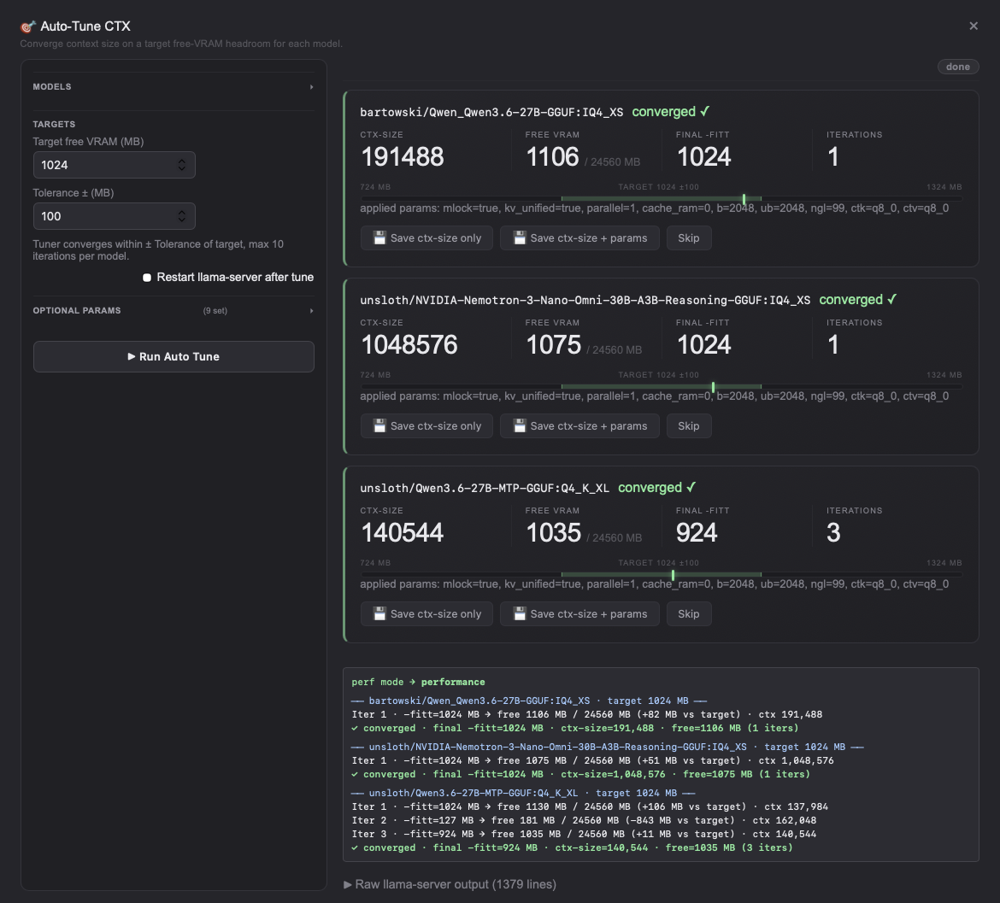
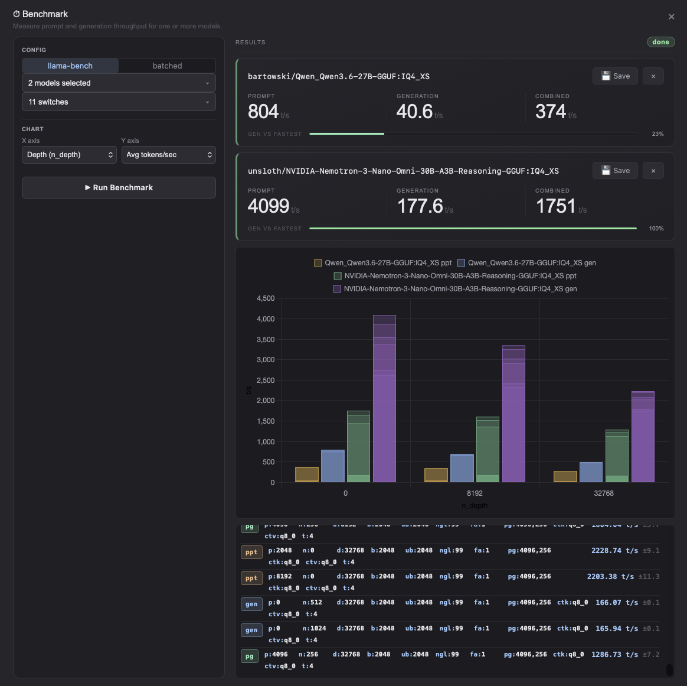
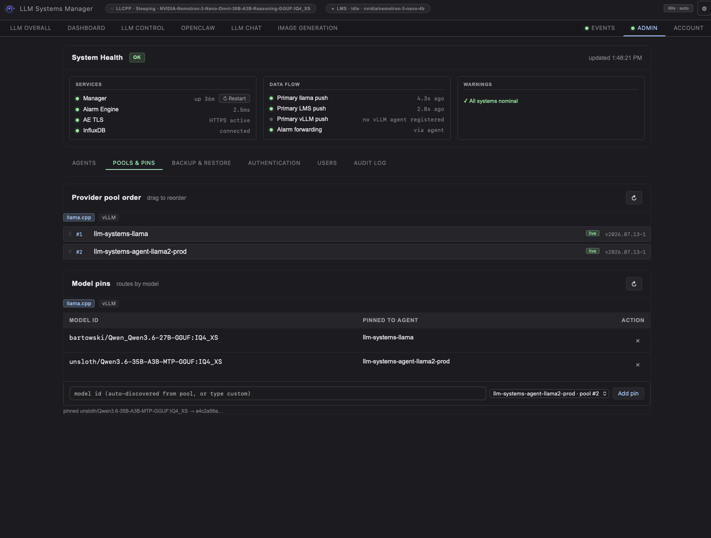

# LLM Systems Manager

A complete, self-hosted operations platform for LLM infrastructure — monitoring, remote control, tuning, routing, alerting, and much more, all in one place.

It currently integrates [llama.cpp](https://github.com/ggerganov/llama.cpp), [vLLM](https://github.com/vllm-project/vllm), [LM Studio](https://lmstudio.ai/), [stable-diffusion.cpp](https://github.com/leejet/stable-diffusion.cpp), and [OpenClaw](https://github.com/openclaw/openclaw) session telemetry, but the agent reports general host metrics for any Linux or macOS machine. New integrations with Ollama are on the roadmap.

## Top features

**1. OpenAI-compatible inference gateway.** One endpoint on the manager serves every `llama.cpp` host. Requests can be routed by per-model pinning, round-robined across a dedicated pool, or failed over to another live host if a backend is down. Apps target one stable URL that looks like a single server. Streaming and non-streaming both work. See [Inference gateway](#inference-gateway).

**2. Benchmarking and autotuning built in.** Run throughput benchmarks across every model in your library, and let the autotuner search for the best context/slot configuration on `llama.cpp` or the largest safe `max-model-len` on vLLM. Each model ends up tuned to the hardware it actually runs on.

**3. Model management with profiles, cards, and cache control.** Browse and pull models straight from Hugging Face, then prune individual files to reclaim disk. Every model keeps multiple named config profiles (e.g. chat / code / general); switching profiles from the model card reloads the running model with those settings in one click.

**4. Energy and thermal control via the performance manager.** A per-host controller tracks the inference server and switches the CPU governor and cooling/fan profiles to match the load — full performance while a model is working, quiet and low energy usage when it goes idle or sleeps.

**5. Remote control of the whole infrastructure.** Start/stop/restart inference servers, hot-swap models, edit per-model configurations, update and configure `llama.cpp`, tail logs, or open an in-browser terminal — for any host, from one page. One cross-platform agent covers Linux and macOS/Apple Silicon, auto-detects what each box runs, with per-agent selection. An **LLM Overall** view rolls multiple host metrics into one pane.

**6. LLM-aware telemetry and alerting.** Live metrics from the inference server include slots, tokens/sec, prompt-processing, KV cache, and context, plus system and GPU/PSU/UPS/cooling metrics. A standalone alarm engine stores every sample, evaluates threshold and anomaly rules, notifies over email/toast/webhook/Discord, buffers to disk and replays when the network returns, and collapses a burst of related issues into single incidents.

*Also included:* multi-user roles + admin audit log, encrypted scheduled backups, OpenClaw cost/budget analytics, an image generation tab, and TLS/mTLS on every connection — see the [full feature list](#full-included-features) below.

---


**Llama dashboard** - view real time metrics on the llama.cpp server


**Lmstudio dashboard** - view real time metrics on the lmstudio server


**Model control** — start/stop inference servers, change models, control the provider, manage the model library, run benchmarks, auto tune models.


**Autotune & benchmark** — search for the fastest context/slot settings per model and benchmark your whole model library.



**Openclaw dashboard** - openclaw metrics and analytics


**Manager dashboard** — view overall manager and agent health.


**Alarm engine** — trend graphs, rule and notification editor, alert timeline.


**Admin console** - agent management, user & login management, backup/restore, inference routing




---

## Full included features

The six headline capabilities plus everything else that ships in the box:

- **OpenAI-compatible inference gateway.** One endpoint (`/api/gateway/v1`) fronts the whole `llama.cpp` fleet — per-model pin, then pool round-robin, then pre-first-token failover route each request to a healthy backend, so every app sees one server. Dashboard-session access by default; add API keys for external clients. See [Inference gateway](#inference-gateway).
- **Benchmarking & autotuning.** Throughput benchmarks across your entire model library, plus autotuners for `llama.cpp` context/slot counts and vLLM `max-model-len` — each model tuned to the hardware it actually runs on.
- **Model management.** A built-in Hugging Face browser downloads and prunes models file-by-file; every model keeps named config profiles (chat / code / general) that swap and reload straight from its model card in one click.
- **Energy & thermal control.** A per-host performance manager flips CPU governor and fan/cooling profiles with inference load — full power under work, quiet and low-draw when idle or asleep.
- **Remote control, no SSH.** Start/stop/restart servers, hot-swap models, edit configs, update `llama.cpp` (build from source, conda, Homebrew, release binaries, or a custom script), tail logs, and open an in-browser PTY terminal — for any host, from the page.
- **LLM runtime visibility.** Live inference internals — slots, tokens/sec, prompt-processing rate, KV cache, context, idle/awake, active chat template, modalities, total slots — plus LM Studio loaded models and active sessions.
- **Fleet in one pane.** Run the same backend on many hosts and a picker appears to switch views and controls per agent; the **LLM Overall** tab rolls combined throughput, hottest GPU, total power, and active models into one view. A single-host lab sees no change.
- **Cross-platform agent.** One agent for Linux and macOS/Apple Silicon auto-detects what each host runs and enables only what's relevant; a bare host just reports system metrics, all served over TLS.
- **Live host telemetry.** CPU, RAM, disk, network, GPU utilization, PSU, UPS battery, and AIO cooling stats.
- **Alerting that survives outages.** A standalone alarm engine persists every metric to InfluxDB, evaluates threshold and anomaly rules, and routes alerts via email, toast, webhook, or Discord. Agents buffer to disk if the engine is down and replay when it returns.
- **Incident correlation, not alert spam.** When one event trips several rules on a host at once (GPU temp, VRAM, fan speed), the engine groups them into a single **incident** — one notification, with the Events table and toasts collapsing members behind a "+N related" count. Resolved alerts roll into a history table with configurable retention so the active view stays fast.
- **At-a-glance status.** A dot on the **Events** tab turns red on any active critical alert; a dot on **Admin** turns red when system health degrades (stale/down agents, disconnected services, cert warnings). Both update on every tab.
- **Direct LLM chat.** Talk to any loaded model through the embedded `llama.cpp` web interface.
- **OpenClaw cost analytics.** Session logs become token-usage, cost, and tool-attribution dashboards with monthly spend projection and — given a budget — warning/ceiling alerts (and optional cost-anomaly alerts) through the alarm engine.
- **Image generation.** An optional tab drives `stable-diffusion.cpp` for text-to-image.
- **Multi-user access control.** Named accounts with **Admin** / **Operator** roles — operators drive LLMs and watch dashboards but are kept out of the Admin tab, agent management, secrets, and shells. Self-service password change plus username + source-IP lockout after repeated failed logins.
- **Admin audit log.** Every mutating admin action (approve/disable/delete agents, restarts, auth-mode changes, user management, config writes, exports/imports) is recorded — who, what, when, from where, success or not — and browsable in **Admin → Audit Log**.
- **Scheduled backups.** The manager writes a full export archive (config, agent registry, CA, users, model profiles, benchmarks) on an interval with retention pruning, optional AES-256-GCM encryption, and an optional mirror directory; last/next-run status shows in **Admin → Backup & Restore**, and the same archive restores through Import.
- **Encrypted everywhere.** All agent ↔ manager and agent ↔ alarm-engine traffic runs over TLS, with per-agent leaf certs signed by the manager's internal CA.


## Donations

If you find this project useful, please consider leaving a donation

<!--START_SECTION:buy-me-a-coffee-->
<a href="https://www.buymeacoffee.com/llmsystems" target="_blank"></a>
<!--END_SECTION:buy-me-a-coffee-->
---

## Installation options

The **fully automated script installer** (Quickstart below) is the preferred path — it handles prerequisites, InfluxDB, config, TLS, agents, and updates end-to-end. The alternatives cover specific scenarios:

| Method | Best for |
|---|---|
| **Script installer** (preferred) | Everything: full stack, split installs, agents, offline installs, updates — see [Quickstart](#quickstart--single-host) |
| [Native packages (`.deb`/`.rpm`)](#native-packages-deb--rpm) | Hosts standardized on apt/dnf package management |
| [Docker Compose](#docker-compose-control-plane-only) | Containerized control plane (manager + alarm engine + InfluxDB) |
| [Agent binary tarball](#agent-binary-no-python-required) | Agent-only hosts without Python (Linux/macOS), manual layout control |

## Quickstart — single host

For a quick installation on one host, choose the full install option:

```bash
bash <(curl -fsSL https://raw.githubusercontent.com/llmsyscore/llm-systems-manager/main/tools/installer/install.sh)
```

The installer is interactive: it prompts for SMTP credentials (if you want email alerts), the manager admin login, and confirms before installing system packages. It then enables the systemd units but **does not start anything automatically** — it prints the exact `systemctl start` commands so you stay in control of timing.

The installer deploys the **latest [GitHub Release](https://github.com/llmsyscore/llm-systems-manager/releases)** — a source tarball whose SHA-256 checksum is verified before anything is installed; a mismatch aborts. To pin a specific version, or to track the development tip from a git clone of `main` instead (the advanced/bare-metal path — code that hasn't been cut into a release yet):

```bash
# pin a specific release
bash <(curl -fsSL https://raw.githubusercontent.com/llmsyscore/llm-systems-manager/main/tools/installer/install.sh) --ref v1.0.0

# track unreleased main (advanced)
bash <(curl -fsSL https://raw.githubusercontent.com/llmsyscore/llm-systems-manager/main/tools/installer/install.sh) --source git
```

The same `--ref` / `--source` flags apply to every install mode and to `--update`.

### Offline / air-gapped install

Hosts with no access to GitHub can install from a release tarball staged out-of-band. On a connected machine, download `llm-systems-manager-<tag>.tar.gz` from the [Releases page](https://github.com/llmsyscore/llm-systems-manager/releases) (verify it against the published `.sha256` yourself — the offline path trusts the tree you hand it). Copy it to the target host, then:

```bash
tar -xzf llm-systems-manager-v1.0.0.tar.gz
sudo bash llm-systems-manager-v1.0.0/tools/installer/install.sh --source local
```

`--source local` installs the extracted tree the script lives in: no release download, no git clone, no installer self-update (`git` itself is not required on the target host). It works with every install mode and with `--update` (offline update of an existing install). Note the scope: only GitHub access is eliminated — installing system packages and the Python virtualenvs still uses `apt` and `pip`, so a fully air-gapped host needs local mirrors for those (or pre-provisioned dependencies).

After install:

1. Start the services if they were not started at installation, the commands to start them will be shown by the installer.
2. Open `http://<this-host>:5000/` in a browser. Log in with the admin credentials you set.
3. From the **Admin** tab, approve any agents that have registered. Approval issues each agent a per-host TLS certificate and unlocks remote control.

That's it for a single-host lab. Everything else below is for adding more hosts or pointing the dashboard at inference servers you already run.

### Docker Compose (control plane only)

Prefer containers? No repo checkout needed — `curl` down `docker-compose.yml` + `.env.example`, fill in the secrets, and `docker compose up -d` brings up the manager + alarm engine + InfluxDB from multi-arch images published to ghcr.io on every release — see [docker/README.md](docker/README.md). Agents still install natively on each host (they need sensor/GPU/systemd access).

### Native packages (.deb / .rpm)

Every [release](https://github.com/llmsyscore/llm-systems-manager/releases) also ships native packages for Debian/Ubuntu and RHEL-family distros: `llm-systems-manager` (manager + alarm engine; InfluxDB stays external — declared as a Recommends, with a pointer printed if it's unreachable) and per-arch `llm-systems-agent` packages built around the self-contained binary:

```bash
sudo apt install ./llm-systems-manager_<version>_all.deb        # debconf prompts for admin login + SMTP
sudo dnf install ./llm-systems-manager-<version>-1.noarch.rpm   # EL9 needs python3.11 first; defaults, then edit config
sudo apt install ./llm-systems-agent_<version>_amd64.deb        # agent; prompts for the manager URL
```

Packages create the `llmsys` user, install + start the systemd units, and build the Python venvs at install time (network to PyPI required; the agent package needs none — it's a single binary). Config survives upgrades; `apt purge` removes everything the package created (state from another install method is kept). Install methods don't mix — packages and the script installer refuse to overwrite each other. Details, RPM variants, and uninstall behavior: [docs/DEPLOYMENT.md](docs/DEPLOYMENT.md#installing-from-native-packages-deb--rpm).

---

## Agent installation

The agent is what pushes all data into the dashboard. Run the installer and use the mode 5 (agent installation) option on every machine you want to monitor and control (Linux or macOS):

```bash
bash <(curl -fsSL https://raw.githubusercontent.com/llmsyscore/llm-systems-manager/main/tools/installer/install.sh)
```

The agent registers itself with the manager on first launch. From **Admin → Agents**, click **Approve** — the manager signs a TLS cert for that agent and starts polling it.

### Agent binary (no Python required)

Every [release](https://github.com/llmsyscore/llm-systems-manager/releases) also ships the agent as a per-platform tarball (`llm-systems-agent-linux-x86_64.tar.gz`, `-linux-arm64.tar.gz`, `-macos-arm64.tar.gz`) with a `.sha256` checksum — no Python or venv needed on the host. Each tarball bundles the self-contained binary, a fully documented `agent_config.yaml.example`, and the platform's service-manager unit (`llm-systems-agent-binary.service.tmpl` on Linux, `com.llm-systems-agent-binary.plist.tmpl` on macOS), so one download + extract gives you a ready-to-edit install. On Linux:

```bash
sudo mkdir -p /opt/llm-systems-agent && cd /opt/llm-systems-agent
sudo curl -fsSLO https://github.com/llmsyscore/llm-systems-manager/releases/latest/download/llm-systems-agent-linux-x86_64.tar.gz
sudo curl -fsSLO https://github.com/llmsyscore/llm-systems-manager/releases/latest/download/llm-systems-agent-linux-x86_64.tar.gz.sha256
sha256sum -c llm-systems-agent-linux-x86_64.tar.gz.sha256   # macOS: shasum -a 256 -c <file>.sha256
sudo tar -xzf llm-systems-agent-linux-x86_64.tar.gz         # -> binary + agent_config.yaml.example + .service.tmpl
sudo chmod +x llm-systems-agent
sudo cp agent_config.yaml.example agent_config.yaml         # then edit: at minimum set MANAGER_URL
sudo chown -R <run-as-user>: /opt/llm-systems-agent
```

Then install the systemd unit from the extracted `llm-systems-agent-binary.service.tmpl` (substitute `${AGENT_USER}`, `${AGENT_GROUP}`, `${AGENT_INSTALL_DIR}`) into `/etc/systemd/system/llm-systems-agent.service` and `systemctl enable --now llm-systems-agent`. 

Provider flags (`LLAMA_ENABLED`, `LMS_ENABLED`, sudo wrappers for service control, udev rules for liquidctl) are what the full installer automates — every option is documented inline in `agent_config.yaml.example`, so set them in your copied `agent_config.yaml` as needed. 

On macOS, download the `-macos-arm64.tar.gz` tarball instead; it bundles the same binary + `agent_config.yaml.example` plus the `com.llm-systems-agent-binary.plist.tmpl` launchd unit. Clear the quarantine attribute first (`xattr -d com.apple.quarantine llm-systems-agent`), then use the extracted `com.llm-systems-agent-binary.plist.tmpl` (substitute `${AGENT_USER}`, `${AGENT_USER_HOME}`, `${AGENT_INSTALL_DIR}`) as the launchd unit. Linux binaries need glibc 2.35+ (Ubuntu 22.04 / Debian 12 or newer).

Binary agents built from this release onward can also be upgraded from
**Admin → Agents → Update**: the agent downloads the latest release tarball for
its platform, verifies the `.sha256`, extracts and smoke-tests the staged
binary, swaps it atomically (previous binary kept beside it as
`.self-update.bak.<ts>`), and restarts. Older binaries still need one manual
replacement first.

Approve a second agent that runs the same provider (e.g. a second `llama.cpp` box) and a host picker automatically appears on the matching dashboard sub-tabs — every approved agent is independently viewable and controllable. One agent is the *default* (what the dashboard shows when you haven't picked); set it from **Admin**.

## Multiple Hosts

Typical lab topology:

```
                ┌─────────────────────┐
                │  Manager + Alarm    │  
                │  Engine + InfluxDB  │  
                │  + local agent      │
                └──────────┬──────────┘
                           │
        ┌──────────────────┼──────────────────┐
        │                  │                  │
   ┌────▼─────┐      ┌─────▼────┐       ┌─────▼────┐
   │  GPU     │      │  Mac     │       │  Other   │
   │  host    │      │  Studio  │       │  hosts…  │
   │  agent   │      │  agent   │       │  agent   │
   │  +llama  │      │  + LMS   │       │          │
   └──────────┘      └──────────┘       └──────────┘
```

When you want the **InfluxDB on its own host**, use mode 6 (InfluxDB only) option there first, then choose mode 2 (Manager + alarm) on the manager/alarm-engine host. The installer will prompt for the InfluxDB URL and the Influxdb tokens that were printed during the InfluxDB installation.

When you want the **manager and alarm engine on separate hosts**, use mode 3 (manager only) on the manager hose and mode 4 (alarm engine) on the alarm engine host. 

The installer will prompt for the cross-host URLs and then gives you the exact commands required to copy the alarm engine's TLS certs from the manager host to the alarm engine host.

### Choosing the run-as user

By default the manager and alarm engine run as a dedicated `llmsys` system account (auto-created, password-locked). Passing `--user <name>` to the installer allows you to use a different account, you can also enter the account name during the installation as well:

If the account exists, its real primary group is preserved; if it doesn't, the installer creates it as a system user. The agent installer also accepts the same `--user` flag.

---

## Pointing the agent at your own services

The agent ships with sensible defaults and attempts to automatically configure itself. If your inference servers run on different ports, hosts, or paths, you can override them in the `agent/agent_config.yaml` file on each agent host (the installer drops a template alongside the agent). 

Common keys:

| Key | What it points at | Default |
|---|---|---|
| `LLAMA_API_URL` | Your `llama-server` HTTP endpoint | `http://localhost:8080` |
| `LMS_API_URL` | Your LM Studio API endpoint | `http://localhost:1235` |
| `LLAMA_BIN` | Path to the `llama-server` binary (only needed for the agent's auto-restart / config-edit flows) | auto-detected |
| `LLAMA_CONFIG_INI` | Path to `config.ini` driving `llama-server` | auto-detected |
| `LLAMA_LOG_FILE` | Path to `llama-server.log` (for log-tail + state detection) | auto-detected |
| `LLAMA_BUILD_METHOD` | How the "Update llama.cpp" button installs/upgrades: `custom_script` / `source` / `release_binary` / `conda` / `homebrew` | auto-detected at install |
| `LMS_CMD` | Path to the `lms` CLI | auto-detected (`which lms`) |
| `PROCESS_WATCHLIST` | Process names the agent should report on (psutil-style) | sensible defaults — see the example |

The installer fills most of these in at deploy time via auto-detect and prompts; the file above lists what to override after installation. Any field can also be set via environment variable `LSA_<NAME>` (e.g. `LSA_LLAMA_API_URL=http://...`).

Enable only what's relevant — the agent installer offers `--enable-llama`, `--enable-lms`, and `--enable-perf` flags, and auto-detects most of these from what's installed on the host. 

A host with neither `llama-server` nor LM Studio just reports generic system metrics.

---

## Inference gateway

One OpenAI-compatible endpoint (http://<manager-host>:5000/api/gateway/v1) on the manager serves every approved `llama.cpp` agent in the fleet — so instead of targeting one `llama-server` by host:port, your apps call the manager and it picks a healthy backend for each request:

- `POST /api/gateway/v1/chat/completions`
- `POST /api/gateway/v1/completions`
- `GET  /api/gateway/v1/models`

Routing follows the same precedence as the dashboard: a per-model **pin** first, then an explicit `?agent=` pick, then **pool round-robin**, finally the system **default**. If the chosen backend can't be reached, the gateway **fails over** to the next live agent. Both streaming (`"stream": true`) and non-streaming requests work, and each response carries an `X-Proxied-To` header naming the agent that served it.

**Access.** By default the gateway is reachable from a logged-in dashboard session only. To let external OpenAI-SDK clients in, add one or more keys to `[manager.gateway].api_keys` in `config/llm-systems.toml` and restart the manager — each key is a bearer accepted only on `/api/gateway/*`:

```toml
[manager.gateway]
enabled = true
api_keys = ["sk-your-secret-key"]   # empty = dashboard-session access only
read_timeout_s = 600.0              # generation can take minutes on big models
```

**Call it like any OpenAI endpoint:**

```python
from openai import OpenAI

client = OpenAI(
    base_url="http://<manager-host>:5000/api/gateway/v1",
    api_key="sk-your-secret-key",       # any configured key
)
resp = client.chat.completions.create(
    model="<model-id>",                 # from GET /v1/models; drives pin routing
    messages=[{"role": "user", "content": "Hello!"}],
)
print(resp.choices[0].message.content)
```

or with curl:

```bash
curl http://<manager-host>:5000/api/gateway/v1/chat/completions \
  -H "Authorization: Bearer sk-your-secret-key" \
  -H "Content-Type: application/json" \
  -d '{"model":"<model-id>","messages":[{"role":"user","content":"Hello!"}]}'
```

The gateway forwards over the existing bearer + TLS agent channel, and admin/control endpoints are never exposed. Serving LM Studio through the same gateway is on the roadmap.

---

## Architecture

```
                              ┌────────────────────────┐
                              │       Browser          │
                              │  (single-page dash)    │
                              └───────────┬────────────┘
                                          │ HTTP / SSE / WebSocket
                                          ▼
                              ┌────────────────────────┐
                              │   Manager (Flask)      │
                              │  • UI + REST API       │
                              │  • Reverse proxies     │
                              │  • Agent registry      │
                              │  • Internal CA (mTLS)  │
                              └─┬──────────────────┬───┘
                  proxies       │                  │  forwards control
                                │                  │
                 ┌──────────────▼────────┐    ┌────▼────────────────┐
                 │   Alarm Engine        │    │  Agents (FastAPI)   │
                 │   (FastAPI)           │    │  TLS, bearer auth   │
                 │  • Ingests metrics    │◀───┤  • Host telemetry   │
                 │  • Rule evaluation    │    │  • llama / LMS ctrl │
                 │  • Notifications      │    │  • PTY + log tail   │
                 │  • WebSocket → UI     │    │  • Disk buffer      │
                 └──────────────┬────────┘    └─────────────────────┘
                                │
                       ┌────────▼─────────────┐
                       │   InfluxDB v2        │
                       │  metrics time-series │
                       │  (raw + rollups)     │
                       ├──────────────────────┤
                       │   SQLite (WAL)       │
                       │  alerts · rules ·    │
                       │  channels · history  │
                       └──────────────────────┘
```

### The three services

| Service | Role | Where it runs |
|---|---|---|
| **Manager** | Web UI, REST API, reverse proxies for sub-services, agent approval, internal certificate authority, layout/state persistence. | One Linux host. |
| **Alarm Engine** | Ingests every metric sample, persists to InfluxDB, evaluates rules, fires/acks/resolves alerts, dispatches notifications, streams events to the UI over WebSocket. | Same host as the manager, or its own server. |
| **Agent** | Lives on every monitored host. Polls the kernel, sensors, GPU, llama.cpp, LM Studio. Buffers samples to disk if the network is down. Exposes a TLS-only API for remote control. | Every host you want to monitor. |

### How a metric travels

1. The agent samples the host every few seconds, builds a flat JSON sample, and pushes it via a buffered client to the alarm engine.
2. The alarm engine writes the sample into InfluxDB, evaluates active rules, and — if a threshold trips — fires an alert through the notification dispatcher.
3. The browser keeps a WebSocket open to the alarm engine for alert state, and polls the manager for live metrics. The frontend dashboard renders both.

### Storage

InfluxDB v2 is the database for the **time-series metrics** — raw samples plus a one-minute rollup for long-range history. Everything transactional lives in **SQLite** (WAL mode, owned by the alarm engine): alerts and alert history in one database, alarm rules / notification channels / notification policies / delivery history in another. A separate small SQLite file beside the manager holds one secondary table for per-model benchmark averages. UI state (card order, theme) lives in a JSON file beside the manager.

### Security model

- **Dashboard login & roles.** The web UI supports multiple named users with two roles — **Admin** (full access) and **Operator** (can operate the LLMs and view dashboards, but no Admin tab, agent management, secrets, user management, or shells). Admins manage accounts in **Admin → Users** (create / set role / disable / delete / reset password / unlock); every user can change their own password and log out from the top-nav **Account** menu. Fresh installs ship with a default Admin account. Passwords are stored only as an scrypt hash, never in plaintext. Repeated failed logins lock out the username and source IP for a configurable window. Login mode is configurable: `required` (default), `trusted_cidr` (skip login for requests from your admin CIDRs), `disabled`, or `auto` (controlled via the Admin tab in the GUI).
- **Agent auth.** Each agent gets a bearer token at registration, stored locally with restrictive permissions, plus a per-agent TLS leaf cert signed by the manager's internal CA on approval.
- **Manager TLS.** A second HTTPS server runs on the `[manager].tls_port` (default `5443`) using an auto-rotated cert from the internal CA. Approved agents auto-upgrade their control channel from `http://manager:5000` to `https://manager:5443` once they hold the CA.
- **Alarm-engine ingest token.** Agents push metrics directly to the alarm engine (port 8081), so its ingest endpoints are gated by a shared bearer token (`[alarm_engine].ingest_token`). The installer generates one when manager + alarm engine are co-located; agents receive it from the manager on their heartbeat. Left blank, ingest stays open for backward compatibility. `[alarm_engine].tls_enabled` (default `true`) additionally serves the alarm engine over HTTPS using a cert the manager signs from its internal CA.
- **WebSocket proxy.** `[manager].ws_proxy_port` (default `5444`, set `0` to disable) runs a standalone thread that terminates the alarm engine's internal-CA `wss` upstream on the browser's behalf, so the dashboard's Events tab works without you installing the internal CA in your browser. Front it with a real-CA reverse proxy (nginx/Caddy/etc.) for end-to-end `wss`.
- **Inference-gateway keys.** The OpenAI-compatible gateway (`/api/gateway/*`) is reachable from a dashboard session only until you add bearer keys to `[manager.gateway].api_keys`; each key is compared in constant time and accepted only on gateway paths. It reuses the existing agent bearer + TLS channel to reach backends, so it adds no new trust surface.
- **Secrets** (InfluxDB tokens, SMTP password) live in a single config file with restrictive permissions. A documented example template ships in the repo.

### Frontend

The frontend polls the manager every few seconds when something is active and slows down when the lab is idle, also opens event streams for downloads, builds, log tails, and the in-browser terminal.

---

## Configuration

There is one runtime config file: `config/llm-systems.toml`. Both the manager and the alarm engine read from it. A documented template ships as `config/llm-systems.toml.example` — the installer renders the live file from the template and prompts you for the values that have to be host-specific (IPs, SMTP credentials, InfluxDB tokens).

Edit the config, then restart the affected service:

```bash
sudo systemctl restart llm-systems-manager
# or
sudo systemctl restart llm-systems-alarm-engine
```

Per-agent settings live in `agent/agent_config.yaml` on each agent host.

---

## Updating

Re-running the installer is safe: existing configs are backed up with a timestamp before any rewrite, and existing virtual environments are reused. 

For an in-place update of an installed host:

```bash
# Detect, diff, back up, sync only what changed, restart affected services
sudo bash /opt/llm-systems-manager/tools/installer/install.sh --update
```

Or pick **mode 7 (Update)** from the interactive menu. Update preserves the run-as user that was already in place — you don't need to re-pass `--user`.

---

## Supported platforms

The manager, alarm engine, and InfluxDB are tested on **Debian and Ubuntu derivatives**.

- **Other Linux distros** (Fedora, Arch, openSUSE, Alpine): the agent (mode 5) auto-detects `dnf` / `yum` / `brew` and works out of the box. The manager / alarm engine / InfluxDB modes (1–4, 6) will halt at the pre-requisites step with a hint for your package manager — install the listed packages by hand, then re-run.
- **macOS** (Apple Silicon, tested on M2 Pro): agent only.

The installer checks for: `python3` (≥ 3.10), `python3-venv`, `git`, `jq`, `curl`, and `rsync`.

---

## Troubleshooting and Uninstall

| Symptom | Where to look |
|---|---|
| Dashboard won't load / 502 in the browser | `sudo systemctl status llm-systems-manager` then `sudo journalctl -u llm-systems-manager -n 100 --no-pager`. |
| Host doesn't appear in the dashboard | Agent installed but not approved: **Admin → Agents → Approve**. Approved but no data: check the agent log with `sudo journalctl -u llm-systems-agent -f` on that host. |
| Agent shows up but metrics are flat | The agent is probably not reaching the alarm engine. On the agent host: `curl -i http://<manager-host>:8081/health` (or `https://...` if AE TLS is on). 401 means the agent doesn't have the ingest token yet — wait one heartbeat (≤60 s) or restart it. |
| Alarm engine red dot in the Admin tab | Open `http://<manager-host>:5000/api/admin/system-health` to see which component is degraded. Common causes: AE TLS cert missing on a split multi server install (copy `ae-tls.{crt,key}` from manager → AE host ../data directory), ingest token mismatch (both hosts must carry the same value), InfluxDB down. |
| Need to start over | `bash /opt/llm-systems-manager/tools/installer/install.sh --uninstall` walks through removing services, the install tree, the runtime user, and (with confirmation) InfluxDB itself. |

---

## Project layout

```
llm-systems-manager/        Flask manager — backend/ (auth, multi-user management, agent registry, terminal, reverse proxies, OpenClaw analytics, shared app context, internal CA, archive) and frontend/ (single-page UI)
agent/                      Cross-platform telemetry + control agent (+ install/)
llm-systems-alarm-engine/   Standalone alarm engine (FastAPI)
config/                     Unified TOML config + typed loader
tools/                      Universal installer (tools/installer/), smoke tests, benchmark harness
docs/                       Architecture notes, prereqs, screenshots
```

---
## Contributing / Donations

Issues and pull requests are welcome.

If you find this project useful, please consider leaving a donation

<!--START_SECTION:buy-me-a-coffee-->
<a href="https://www.buymeacoffee.com/llmsystems" target="_blank"></a>
<!--END_SECTION:buy-me-a-coffee-->

---

## License

[GNU Affero General Public License v3.0](LICENSE) — full text in the `LICENSE` file at the repo root.
