# LLM Systems Manager

A complete, self-hosted operations platform for LLM infrastructure — monitoring, remote control, tuning, routing, alerting, and much more, all in one place.

It currently integrates [llama.cpp](https://github.com/ggerganov/llama.cpp), [vLLM](https://github.com/vllm-project/vllm), [LM Studio](https://lmstudio.ai/), [stable-diffusion.cpp](https://github.com/leejet/stable-diffusion.cpp), and [OpenClaw](https://github.com/openclaw/openclaw) session telemetry, but the agent reports general host metrics for any Linux or macOS machine. New integrations with Ollama are on the roadmap.

## Install

The **script installer** is the preferred path — one interactive command handles prerequisites, InfluxDB, config, TLS, and agents. It enables the systemd units but never starts a service without you:

```bash
bash <(curl -fsSL https://raw.githubusercontent.com/llmsyscore/llm-systems-manager/main/tools/installer/install.sh)
```

<details>
<summary><b>Native packages (.deb / .rpm)</b> — hosts standardized on apt or dnf</summary>

Packages ship with every [release](https://github.com/llmsyscore/llm-systems-manager/releases). They create the service user, start the systemd units, and prompt for the admin login.

```bash
# Debian / Ubuntu — resolves the newest .deb from the latest release
url=$(curl -fsSL https://api.github.com/repos/llmsyscore/llm-systems-manager/releases/latest \
        | grep -oE '"https://[^"]+_all\.deb"' | tr -d '"')
curl -fsSLO "$url" && sudo apt install ./"${url##*/}"

# RHEL / Fedora
url=$(curl -fsSL https://api.github.com/repos/llmsyscore/llm-systems-manager/releases/latest \
        | grep -oE '"https://[^"]+\.noarch\.rpm"' | tr -d '"')
curl -fsSLO "$url" && sudo dnf install ./"${url##*/}"
```
</details>

<details>
<summary><b>Docker Compose</b> — containerized control plane</summary>

Brings up the manager, alarm engine, and InfluxDB from multi-arch images on ghcr.io. Fill in `.env` first. Agents still install natively on each host, since they need sensor, GPU, and systemd access.

```bash
curl -fsSLO https://raw.githubusercontent.com/llmsyscore/llm-systems-manager/main/docker-compose.yml
curl -fsSL https://raw.githubusercontent.com/llmsyscore/llm-systems-manager/main/.env.example -o .env
docker compose up -d
```
</details>

<details>
<summary><b>Homebrew</b> — macOS (Apple Silicon) and Linux</summary>

Installs the control plane from the project tap, onboards InfluxDB, and starts both services. `brew upgrade` tracks new releases automatically.

```bash
brew tap llmsyscore/tap && brew trust llmsyscore/tap
brew install llm-systems-manager llm-systems-alarm-engine influxdb@2 influxdb-cli
llm-systems-influx-setup
brew services start llm-systems-manager
brew services start llm-systems-alarm-engine
```
</details>

<details>
<summary><b>Agent binary tarball</b> — agent-only hosts without Python</summary>

A self-contained agent binary for Linux and macOS, for hosts where you want manual layout control. See [Agent installation](#agent-installation).
</details>

Full details for every method, including split installs, offline installs, and updates: [Installation options](#installation-options).

## Top features

**1. Model Autopilot.** Declare which models should stay available; Autopilot places each one only on a host with the memory to hold it (VRAM, or RAM on CPU-only hosts), rebuilds it elsewhere when a host drops out, and scales copies with demand. Off by default — it proposes, you approve. **Admin → Routing** ([screenshot](#screenshots)).

**2. OpenAI-compatible inference gateway.** One endpoint fronts `llama.cpp`, LM Studio, and vLLM together. `/v1/models` returns the merged catalog; requests route by per-model pin, pool round-robin, or failover to a live host. Apps target one stable URL, streaming or not. See [Inference gateway](#inference-gateway).

**3. GPU Report Card.** One standardized benchmark, one shareable card — time-to-first-token, prefill and generation throughput, tokens/joule, measured $/Mtok, and the GPU it ran on. The same preset runs on all three providers, so results compare across machines.

**4. Energy and cost intelligence.** What inference really costs in **$/Mtok**, with monthly savings against hosted-API pricing and idle power attributed honestly. A per-host performance manager matches CPU governor and cooling profile to load — full speed under work, quiet when idle ([screenshot](#screenshots)).

**5. Benchmarking and autotuning built in.** Benchmark your whole model library, and let the autotuner find the best context/slot configuration on `llama.cpp` or the largest safe `max-model-len` on vLLM — every model tuned to the hardware it runs on.

**6. Model management with profiles and cache control.** Pull models straight from Hugging Face and prune files to reclaim disk. Every model keeps named profiles (chat / code / general) that reload it with those settings in one click.

**7. Remote control of the whole infrastructure.** Run the servers, hot-swap models, edit configs, update `llama.cpp`, tail logs, and open an in-browser terminal — any host, one page. A Discord bot exposes the same commands, one agent covers Linux and macOS/Apple Silicon, and **LLM Overall** rolls every host into a single pane.

**8. LLM-aware telemetry and alerting.** Live inference internals — slots, tokens/sec, prompt processing, KV cache, context — beside GPU, PSU, UPS, and cooling stats. A standalone alarm engine stores every sample, evaluates threshold and anomaly rules, notifies by email/toast/webhook/Discord, buffers through outages, and collapses related issues into one incident.

*Also included:* an installable phone companion (PWA) with push alerts, multi-user roles + admin audit log, encrypted scheduled backups, OpenClaw cost/budget analytics, an image generation tab, and TLS/mTLS on every connection — see the [full feature list](#full-included-features) below.

---

## Screenshots

**Video tour** — sign-in, the overall view, every dashboard, model control, chat, image generation, events, admin, and the alarm console:

<video src="https://github.com/user-attachments/assets/fb6f40d5-989a-4e8c-a3f4-7e0326d0a3f1" controls muted width="900"></video>

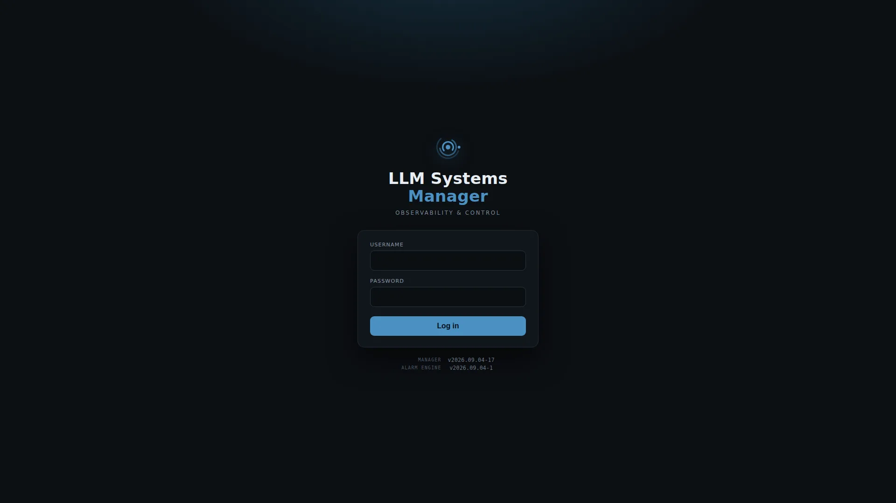

**[▶ Open the screenshot viewer](https://www.llmsyscore.com/#screenshots)** — step through all 14 screens full-size with the arrows.

Or open any screen right here:

<details>
<summary><b>Llama dashboard</b> — live metrics from the `llama.cpp` server and its host</summary>

Live metrics from the `llama.cpp` server and its host.

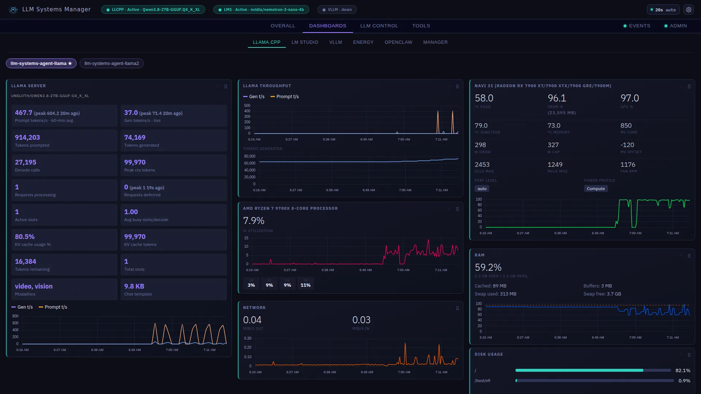
</details>

<details>
<summary><b>LM Studio dashboard</b> — loaded models, host metrics, and Apple-silicon powermetrics</summary>

The server card, loaded models, and host metrics, plus live Apple-silicon powermetrics (SoC / CPU / GPU / ANE watts, thermal pressure, GPU busy). Token counts are measured at the manager gateway.

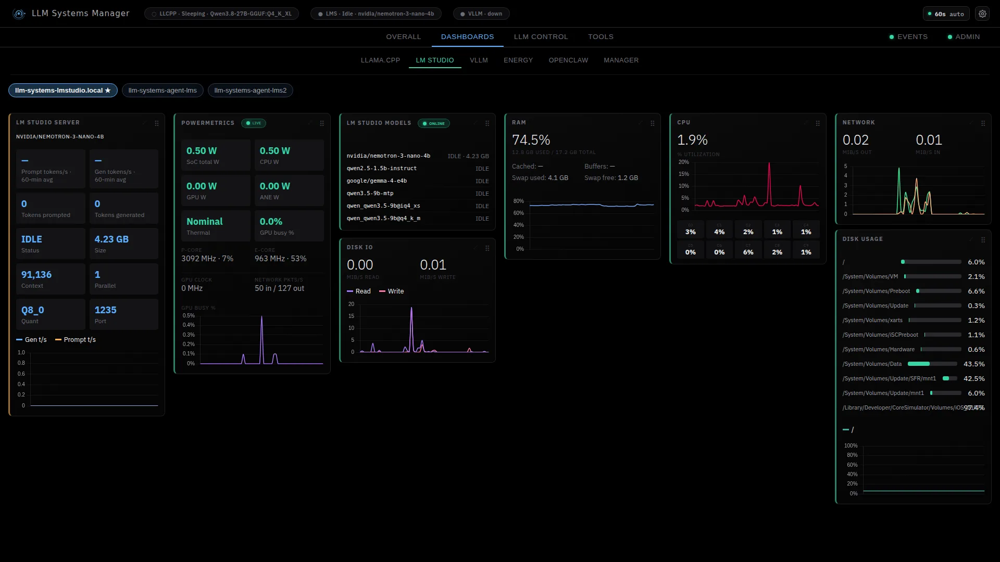
</details>

<details>
<summary><b>Model control</b> — run the servers, swap models, and manage the library</summary>

Start/stop inference servers, change models, control the provider, manage the model library, run benchmarks, auto tune models.

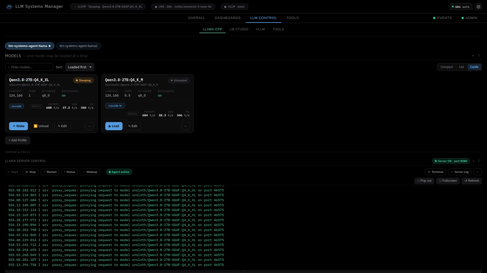
</details>

<details>
<summary><b>Model control — detail</b> — per-model configuration and provider controls</summary>

Per-model configuration and provider controls.

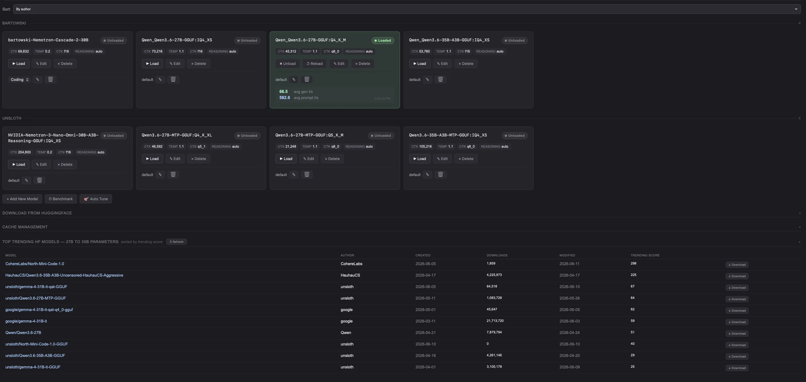
</details>

<details>
<summary><b>Model control — cards</b> — the library as cards, with named config profiles</summary>

The model library as cards, with named config profiles (chat / code / general) that swap and reload in one click.

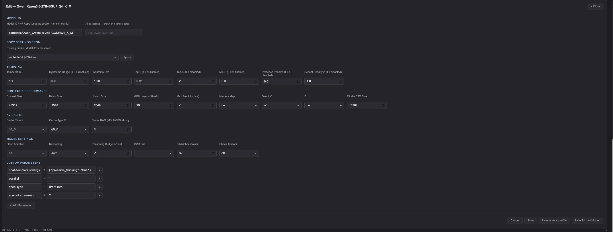
</details>

<details>
<summary><b>Routing & Model Autopilot</b> — pool order, model pins, and the Autopilot editor</summary>

Per-provider pool order and model pins, and the Autopilot editor: one row per model with its placement, failover mode, replica range, and size, each showing whether it is currently placed. Pending proposals are listed below for approval.

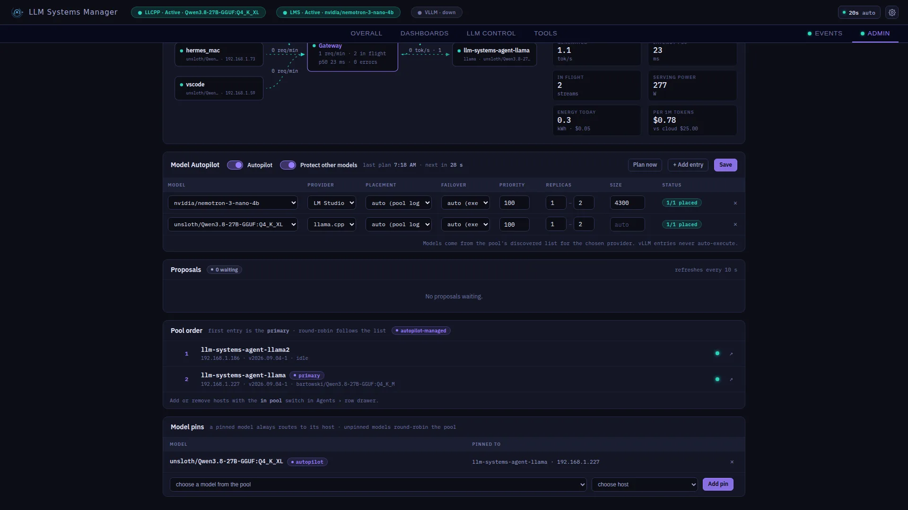
</details>

<details>
<summary><b>Manager dashboard</b> — manager and agent health at a glance</summary>

Overall manager and agent health.

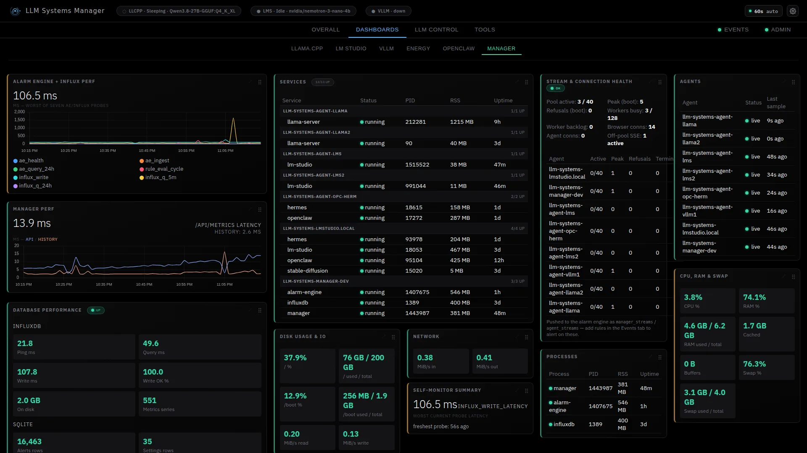
</details>

<details>
<summary><b>Alarm engine</b> — alerts, anomalies, trend graphs, and the rule editor</summary>

Live alerts, anomalies, trend graphs, rule and notification editor, alert timeline.

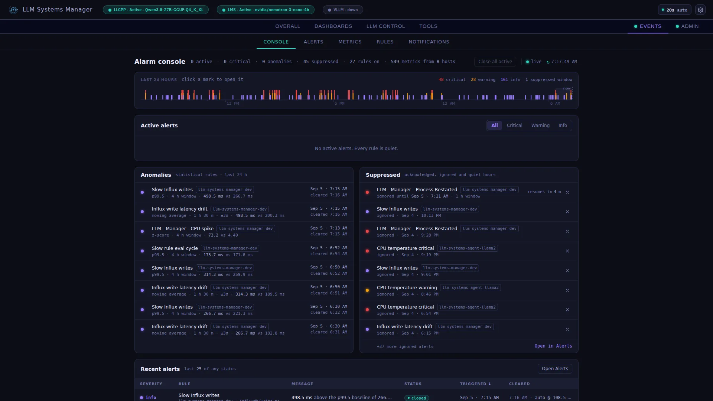
</details>

<details>
<summary><b>Admin console</b> — system health, access control, agents, and the audit log</summary>

System health plus sub-tabs for access control, agents, the audit log, backup/restore, and routing. The agents view lists every registered host with its capabilities, pool membership, TLS state, and version.

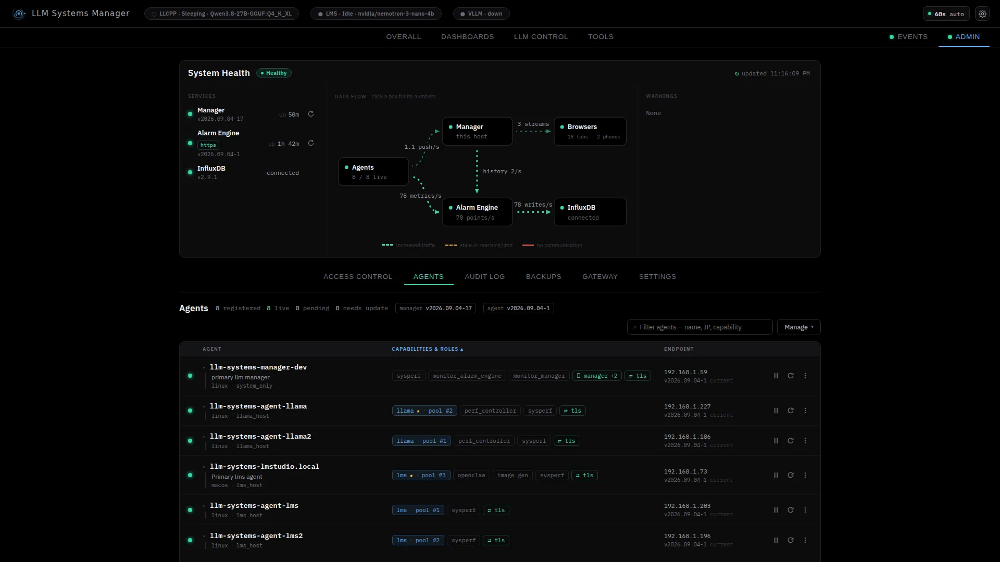
</details>

<details>
<summary><b>Energy & cost dashboard</b> — measured $/Mtok, savings, and active-vs-idle energy</summary>

Measured $/Mtok against your electricity price, savings versus hosted-API pricing, and hourly active-vs-idle energy. The per-host table marks which hosts report power and token telemetry, so the totals say what they're based on.

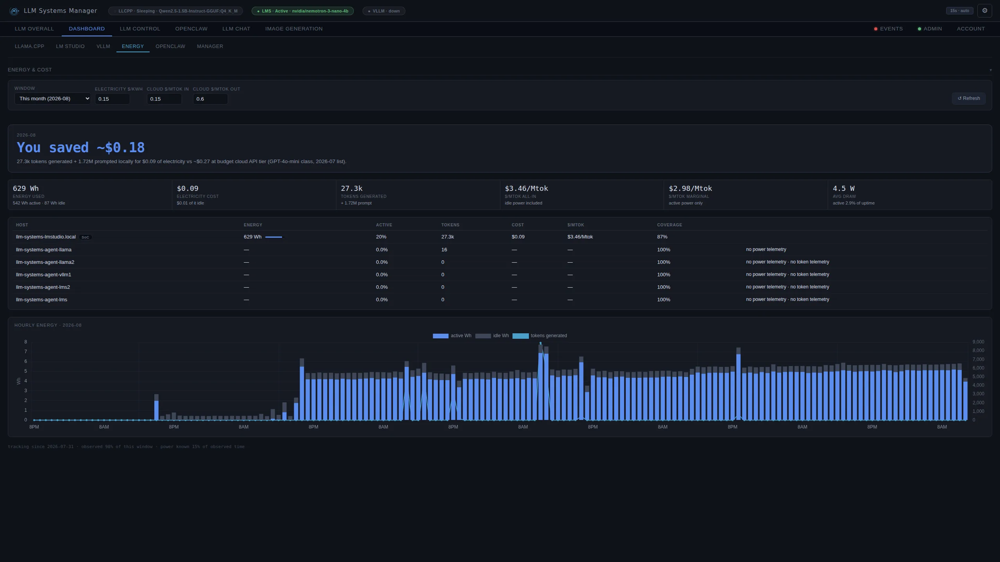
</details>

<details>
<summary><b>OpenClaw dashboard</b> — session cost analytics and tool attribution</summary>

OpenClaw session metrics, cost analytics, and tool attribution.

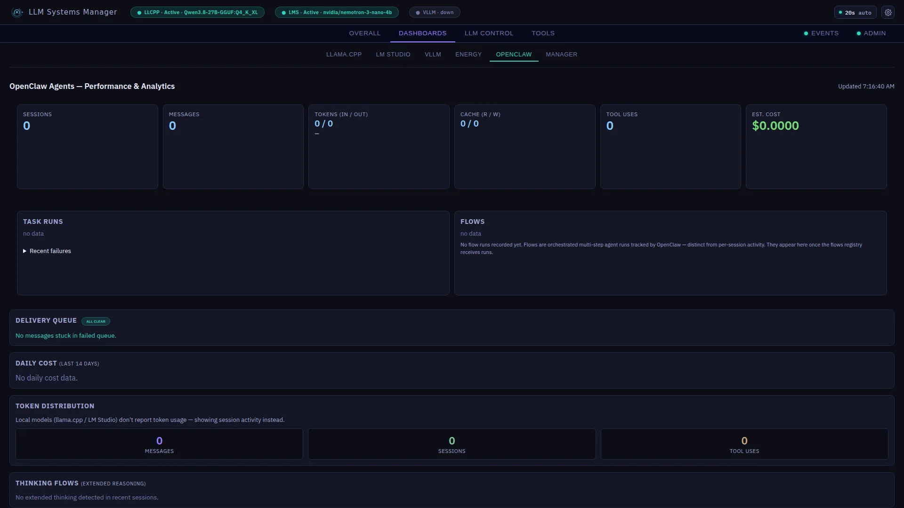
</details>

<details>
<summary><b>Autotune wizard</b> — search for the fastest context/slot settings per model</summary>

Search for the fastest context/slot settings per model.

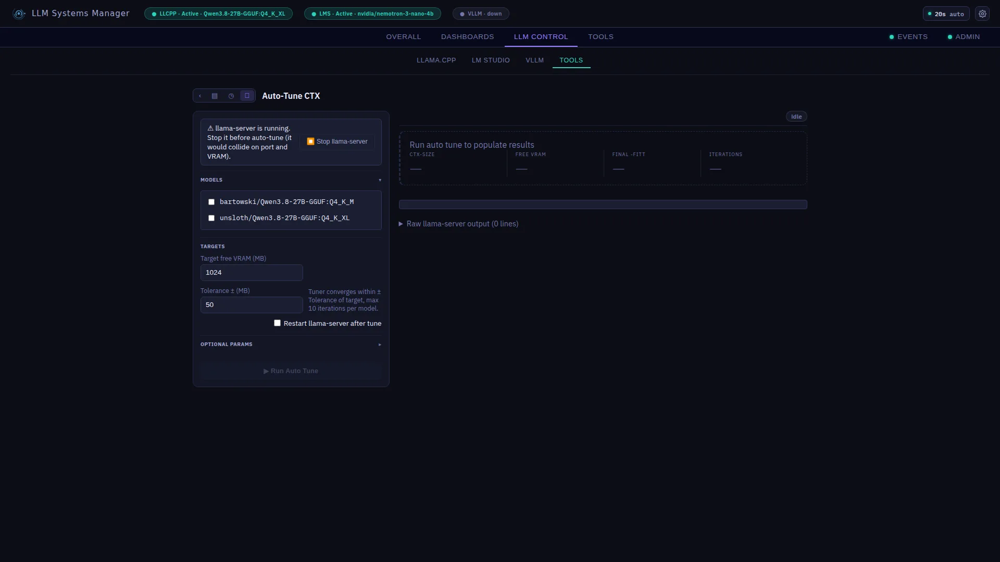
</details>

<details>
<summary><b>Benchmark results</b> — throughput benchmarks across your whole model library</summary>

Throughput benchmarks across your whole model library.

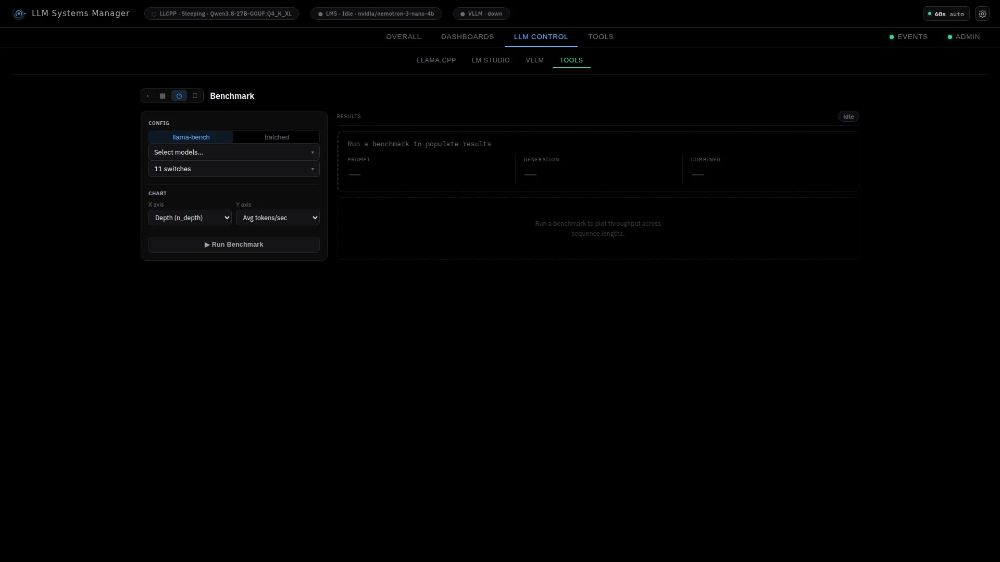
</details>

---

## Full included features

The eight headline capabilities plus everything else that ships in the box:

- **Model Autopilot.** Declared-state model placement gated on a host actually having the memory, with failover when one goes offline and replicas added or removed as demand changes. Off by default. **Admin → Routing**.
- **GPU Report Card.** One standardized benchmark across all three providers producing a comparable, shareable card — TTFT, throughput, tokens/joule, measured $/Mtok, and the GPU it ran on. Runs are stored so you can trend them.
- **Energy & cost intelligence.** Measured **$/Mtok** from real power draw, monthly savings against hosted-API pricing, and idle-power accounting. Only hosts reporting both power and token telemetry count, so a half-instrumented host can't skew the number.
- **Discord bot.** Slash commands for host queries, model load/unload, and alarm acknowledgement, behind a user allowlist with model control off by default.
- **OpenAI-compatible inference gateway.** One endpoint (`/api/gateway/v1`) fronts every provider; `/v1/models` merges all pools, deduped and tagged. Per-model pin, then pool round-robin, then pre-first-token failover. Dashboard sessions by default, API keys for external clients. See [Inference gateway](#inference-gateway).
- **Benchmarking & autotuning.** Library-wide throughput benchmarks, plus autotuners for `llama.cpp` context/slot counts and vLLM `max-model-len`.
- **Model management.** A built-in Hugging Face browser downloads and prunes models file-by-file; named profiles (chat / code / general) swap and reload from the model card in one click.
- **Energy & thermal control.** A per-host performance manager flips CPU governor and fan profiles with inference load — full power under work, quiet when idle.
- **Remote control, no SSH.** Run the servers, hot-swap models, edit configs, update `llama.cpp` (source, conda, Homebrew, release binaries, or your own script), tail logs, and open an in-browser PTY terminal.
- **LLM runtime visibility.** Slots, tokens/sec, prompt-processing rate, KV cache, context, idle/awake, chat template, and modalities, plus LM Studio loaded models and sessions.
- **Every host in one pane.** A picker switches views and controls per agent, and **LLM Overall** rolls combined throughput, hottest GPU, total power, and active models into one view. A single-host lab sees no change.
- **Cross-platform agent.** One agent for Linux and macOS/Apple Silicon auto-detects what each host runs and enables only what's relevant — a bare host just reports system metrics, all over TLS.
- **Live host telemetry.** CPU, RAM, disk, network, GPU utilization, PSU, UPS battery, and AIO cooling stats.
- **Alerting that survives outages.** A standalone alarm engine persists every metric to InfluxDB, evaluates threshold and anomaly rules, and routes alerts by email, toast, webhook, or Discord. Agents buffer to disk when it's down and replay when it returns.
- **Incident correlation, not alert spam.** Several rules tripping on one host at once become a single **incident** — one notification, with the Events table collapsing members behind a "+N related" count. Resolved alerts roll into a retention-managed history.
- **At-a-glance status.** Dots on the **Events** and **Admin** tabs turn red on active critical alerts or degraded system health, and amber when a new release is available. Both update from any tab.
- **Phone companion (PWA).** An installable app at `/companion` — Home, Alerts, Energy, Models, Admin, and Settings screens sized for a phone, with alarm-engine alerts delivered as native push notifications even when the app is closed. Model swaps, pins, autopilot approvals, and service restarts each sit behind a confirm sheet, gated to the admin role. See [Phone companion](#phone-companion-pwa).
- **Direct LLM chat.** Talk to any loaded model through the embedded `llama.cpp` web interface.
- **OpenClaw cost analytics.** Session logs become token-usage, cost, and tool-attribution dashboards with monthly spend projection and — given a budget — warning, ceiling, and cost-anomaly alerts.
- **Image generation.** An optional tab drives `stable-diffusion.cpp` for text-to-image.
- **Multi-user access control.** **Admin** / **Operator** roles — operators drive LLMs and watch dashboards but stay out of the Admin tab, agent management, secrets, and shells. Self-service password change plus username + source-IP lockout.
- **Admin audit log.** Every mutating admin action is recorded — who, what, when, from where, success or not — and browsable in **Admin → Audit Log**.
- **Scheduled backups.** Full export archives (config, agent registry, CA, users, model profiles, benchmarks) on an interval, with retention pruning, optional AES-256-GCM encryption, and an optional mirror directory. The same archive restores through Import.
- **Encrypted everywhere.** All agent ↔ manager and agent ↔ alarm-engine traffic runs over TLS, with per-agent leaf certs signed by the manager's internal CA.
- **Bring your own TLS certificate.** Point `[manager].tls_cert_file`/`tls_key_file` at a public or corporate-CA cert and the HTTPS port serves it via SNI for the hostnames it covers, while agents pinned to the internal CA keep working untouched. Required for installing the phone companion from another device.


## Donations

If you find this project useful, please consider leaving a donation

<!--START_SECTION:buy-me-a-coffee-->
<a href="https://www.buymeacoffee.com/llmsystems" target="_blank"></a>
<!--END_SECTION:buy-me-a-coffee-->
---

## Installation options

The **fully automated script installer** (Quickstart below) is the preferred path — it handles prerequisites, InfluxDB, config, TLS, agents, and updates end-to-end. The alternatives cover specific scenarios:

| Method | Best for |
|---|---|
| **Script installer** (preferred) | Everything: full stack, split installs, agents, offline installs, updates — see [Quickstart](#quickstart--single-host) |
| [Native packages (`.deb`/`.rpm`)](#native-packages-deb--rpm) | Hosts standardized on apt/dnf package management |
| [Docker Compose](#docker-compose-control-plane-only) | Containerized control plane (manager + alarm engine + InfluxDB) |
| [Homebrew](#homebrew-control-plane) | brew-managed hosts (macOS Apple Silicon, Linux x86_64/arm64) — [agent](#homebrew-macos--linux) and control-plane formulas, auto-updating |
| [Agent binary tarball](#agent-binary-no-python-required) | Agent-only hosts without Python (Linux/macOS), manual layout control |

## Quickstart — single host

For a quick installation on one host, choose the full install option:

```bash
bash <(curl -fsSL https://raw.githubusercontent.com/llmsyscore/llm-systems-manager/main/tools/installer/install.sh)
```

The installer is interactive: it prompts for SMTP credentials (if you want email alerts), the manager admin login, and confirms before installing system packages. It then enables the systemd units but **does not start anything automatically** — it prints the exact `systemctl start` commands so you stay in control of timing.

The installer deploys the **latest [GitHub Release](https://github.com/llmsyscore/llm-systems-manager/releases)** — a source tarball whose SHA-256 checksum is verified before anything is installed; a mismatch aborts. To pin a specific version, or to track the development tip from a git clone of `main` instead (the advanced/bare-metal path — code that hasn't been cut into a release yet):

```bash
# pin a specific release
bash <(curl -fsSL https://raw.githubusercontent.com/llmsyscore/llm-systems-manager/main/tools/installer/install.sh) --ref v1.0.0

# track unreleased main (advanced)
bash <(curl -fsSL https://raw.githubusercontent.com/llmsyscore/llm-systems-manager/main/tools/installer/install.sh) --source git
```

The same `--ref` / `--source` flags apply to every install mode and to `--update`.

### Offline / air-gapped install

Hosts with no access to GitHub can install from a release tarball staged out-of-band. On a connected machine, download `llm-systems-manager-<tag>.tar.gz` from the [Releases page](https://github.com/llmsyscore/llm-systems-manager/releases) (verify it against the published `.sha256` yourself — the offline path trusts the tree you hand it). Copy it to the target host, then:

```bash
tar -xzf llm-systems-manager-v1.0.0.tar.gz
sudo bash llm-systems-manager-v1.0.0/tools/installer/install.sh --source local
```

`--source local` installs the extracted tree the script lives in: no release download, no git clone, no installer self-update (`git` itself is not required on the target host). It works with every install mode and with `--update` (offline update of an existing install). Note the scope: only GitHub access is eliminated — installing system packages and the Python virtualenvs still uses `apt` and `pip`, so a fully air-gapped host needs local mirrors for those (or pre-provisioned dependencies).

After install:

1. Start the services if they were not started at installation, the commands to start them will be shown by the installer.
2. Open `http://<this-host>:5000/` in a browser. Log in with the admin credentials you set.
3. From the **Admin** tab, approve any agents that have registered. Approval issues each agent a per-host TLS certificate and unlocks remote control.

That's it for a single-host lab. Everything else below is for adding more hosts or pointing the dashboard at inference servers you already run.

### Docker Compose (control plane only)

Prefer containers? No repo checkout needed — `curl` down `docker-compose.yml` + `.env.example`, fill in the secrets, and `docker compose up -d` brings up the manager + alarm engine + InfluxDB from multi-arch images published to ghcr.io on every release — see [docker/README.md](docker/README.md). Agents still install natively on each host (they need sensor/GPU/systemd access).

### Native packages (.deb / .rpm)

Every [release](https://github.com/llmsyscore/llm-systems-manager/releases) also ships native packages for Debian/Ubuntu and RHEL-family distros: `llm-systems-manager` (manager + alarm engine; InfluxDB stays external — declared as a Recommends, with a pointer printed if it's unreachable) and per-arch `llm-systems-agent` packages built around the self-contained binary:

```bash
sudo apt install ./llm-systems-manager_<version>_all.deb        # debconf prompts for admin login + SMTP
sudo dnf install ./llm-systems-manager-<version>-1.noarch.rpm   # EL9 needs python3.11 first; defaults, then edit config
sudo apt install ./llm-systems-agent_<version>_amd64.deb        # agent; prompts for the manager URL
```

Packages create the `llmsys` user, install + start the systemd units, and build the Python venvs at install time (network to PyPI required; the agent package needs none — it's a single binary). Config survives upgrades; `apt purge` removes everything the package created (state from another install method is kept). Install methods don't mix — packages and the script installer refuse to overwrite each other. Details, RPM variants, and uninstall behavior: [docs/DEPLOYMENT.md](docs/DEPLOYMENT.md#installing-from-native-packages-deb--rpm).

### Homebrew (control plane)

The manager and alarm engine also install from the project's [Homebrew tap](https://github.com/llmsyscore/homebrew-tap) — macOS (Apple Silicon) or Linux:

```bash
brew tap llmsyscore/tap
brew trust llmsyscore/tap        # newer Homebrew requires trusting third-party taps
brew install llm-systems-manager llm-systems-alarm-engine influxdb@2 influxdb-cli
```

Each formula builds its own Python venv from the release source tarball. Shared config is seeded at `$(brew --prefix)/etc/llm-systems-manager/llm-systems.toml` (alarm-engine ingest/management tokens pre-generated); state lives under `$(brew --prefix)/var/llm-systems-manager/` and survives upgrades. Bring the stack up in this order — the manager's first boot creates the internal CA and issues the alarm engine's TLS cert:

```bash
llm-systems-influx-setup        # onboards InfluxDB, creates the buckets + scoped
                                # tokens, and writes [influxdb.tokens] into the config
brew services start llm-systems-manager
brew services start llm-systems-alarm-engine
```

`llm-systems-influx-setup` (installed by the manager formula) needs both `influxdb@2` (the v2 server — Homebrew's plain `influxdb` formula is InfluxDB 3.x, whose API this stack does not speak) and `influxdb-cli` (the `influx` command ships separately). To do it by hand instead: `brew services start influxdb@2`, `influx setup`, create the buckets/tokens, and fill `[influxdb.tokens]` in the TOML.

`brew upgrade` tracks new releases automatically (the same tap cron that bumps the agent formula bumps these). The dashboard is at `http://<host>:5000`; the alarm engine can run without InfluxDB, but history and alert evaluation stay degraded until the tokens are filled in.

---

## Agent installation

The agent is what pushes all data into the dashboard. Run the installer and use the mode 5 (agent installation) option on every machine you want to monitor and control (Linux or macOS):

```bash
bash <(curl -fsSL https://raw.githubusercontent.com/llmsyscore/llm-systems-manager/main/tools/installer/install.sh)
```

The agent registers itself with the manager on first launch. From **Admin → Agents**, click **Approve** — the manager signs a TLS cert for that agent and starts polling it.

### Homebrew (macOS / Linux)

On macOS (Apple Silicon) or a Linux host with [Homebrew](https://docs.brew.sh/Homebrew-on-Linux) (x86_64 or arm64), install the agent from the project's Homebrew tap:

```bash
brew tap llmsyscore/tap
brew trust llmsyscore/tap        # newer Homebrew requires trusting third-party taps
brew install llm-systems-agent
```

The formula picks the right prebuilt binary for the platform. Set `MANAGER_URL` in `$(brew --prefix)/etc/llm-systems-agent/agent_config.yaml` (the fully documented `agent_config.yaml.example` is installed alongside it for reference), then run the agent as a service (launchd on macOS, a systemd user unit on Linux):

```bash
brew services start llm-systems-agent
```

`brew upgrade llm-systems-agent` picks up new releases automatically — a scheduled job in the tap tracks each GitHub Release and bumps the formula. The dashboard's **Admin → Agents → Update** self-update also works, but a later `brew upgrade` replaces the binary again, so prefer `brew` on Homebrew-managed hosts. Uninstall with `brew services stop llm-systems-agent && brew uninstall llm-systems-agent`.

### Agent binary (no Python required)

Every [release](https://github.com/llmsyscore/llm-systems-manager/releases) also ships the agent as a per-platform tarball (`llm-systems-agent-linux-x86_64.tar.gz`, `-linux-arm64.tar.gz`, `-macos-arm64.tar.gz`) with a `.sha256` checksum — no Python or venv needed on the host. Each tarball bundles the self-contained binary, a fully documented `agent_config.yaml.example`, and the platform's service-manager unit (`llm-systems-agent-binary.service.tmpl` on Linux, `com.llm-systems-agent-binary.plist.tmpl` on macOS), so one download + extract gives you a ready-to-edit install. On Linux:

```bash
sudo mkdir -p /opt/llm-systems-agent && cd /opt/llm-systems-agent
sudo curl -fsSLO https://github.com/llmsyscore/llm-systems-manager/releases/latest/download/llm-systems-agent-linux-x86_64.tar.gz
sudo curl -fsSLO https://github.com/llmsyscore/llm-systems-manager/releases/latest/download/llm-systems-agent-linux-x86_64.tar.gz.sha256
sha256sum -c llm-systems-agent-linux-x86_64.tar.gz.sha256   # macOS: shasum -a 256 -c <file>.sha256
sudo tar -xzf llm-systems-agent-linux-x86_64.tar.gz         # -> binary + agent_config.yaml.example + .service.tmpl
sudo chmod +x llm-systems-agent
sudo cp agent_config.yaml.example agent_config.yaml         # then edit: at minimum set MANAGER_URL
sudo chown -R <run-as-user>: /opt/llm-systems-agent
```

Then install the systemd unit from the extracted `llm-systems-agent-binary.service.tmpl` (substitute `${AGENT_USER}`, `${AGENT_GROUP}`, `${AGENT_INSTALL_DIR}`) into `/etc/systemd/system/llm-systems-agent.service` and `systemctl enable --now llm-systems-agent`. 

Provider flags (`LLAMA_ENABLED`, `LMS_ENABLED`, sudo wrappers for service control, udev rules for liquidctl) are what the full installer automates — every option is documented inline in `agent_config.yaml.example`, so set them in your copied `agent_config.yaml` as needed. 

On macOS, download the `-macos-arm64.tar.gz` tarball instead; it bundles the same binary + `agent_config.yaml.example` plus the `com.llm-systems-agent-binary.plist.tmpl` launchd unit. Clear the quarantine attribute first (`xattr -d com.apple.quarantine llm-systems-agent`), then use the extracted `com.llm-systems-agent-binary.plist.tmpl` (substitute `${AGENT_USER}`, `${AGENT_USER_HOME}`, `${AGENT_INSTALL_DIR}`) as the launchd unit. Linux binaries need glibc 2.35+ (Ubuntu 22.04 / Debian 12 or newer).

Binary agents built from this release onward can also be upgraded from
**Admin → Agents → Update**: the agent downloads the latest release tarball for
its platform, verifies the `.sha256`, extracts and smoke-tests the staged
binary, swaps it atomically (previous binary kept beside it as
`.self-update.bak.<ts>`), and restarts. Older binaries still need one manual
replacement first.

Approve a second agent that runs the same provider (e.g. a second `llama.cpp` box) and a host picker automatically appears on the matching dashboard sub-tabs — every approved agent is independently viewable and controllable. One agent is the *default* (what the dashboard shows when you haven't picked); set it from **Admin**.

## Multiple Hosts

Typical lab topology:

```
                ┌─────────────────────┐
                │  Manager + Alarm    │  
                │  Engine + InfluxDB  │  
                │  + local agent      │
                └──────────┬──────────┘
                           │
        ┌──────────────────┼──────────────────┐
        │                  │                  │
   ┌────▼─────┐      ┌─────▼────┐       ┌─────▼────┐
   │  GPU     │      │  Mac     │       │  Other   │
   │  host    │      │  Studio  │       │  hosts…  │
   │  agent   │      │  agent   │       │  agent   │
   │  +llama  │      │  + LMS   │       │          │
   └──────────┘      └──────────┘       └──────────┘
```

When you want the **InfluxDB on its own host**, use mode 6 (InfluxDB only) option there first, then choose mode 2 (Manager + alarm) on the manager/alarm-engine host. The installer will prompt for the InfluxDB URL and the Influxdb tokens that were printed during the InfluxDB installation.

When you want the **manager and alarm engine on separate hosts**, use mode 3 (manager only) on the manager hose and mode 4 (alarm engine) on the alarm engine host. 

The installer will prompt for the cross-host URLs and then gives you the exact commands required to copy the alarm engine's TLS certs from the manager host to the alarm engine host.

### Choosing the run-as user

By default the manager and alarm engine run as a dedicated `llmsys` system account (auto-created, password-locked). Passing `--user <name>` to the installer allows you to use a different account, you can also enter the account name during the installation as well:

If the account exists, its real primary group is preserved; if it doesn't, the installer creates it as a system user. The agent installer also accepts the same `--user` flag.

---

## Pointing the agent at your own services

The agent ships with sensible defaults and attempts to automatically configure itself. If your inference servers run on different ports, hosts, or paths, you can override them in the `agent/agent_config.yaml` file on each agent host (the installer drops a template alongside the agent). 

Common keys:

| Key | What it points at | Default |
|---|---|---|
| `LLAMA_API_URL` | Your `llama-server` HTTP endpoint (llama.cpp has announced the default port moves to `:9931`) | `http://localhost:8080` |
| `LMS_API_URL` | Your LM Studio API endpoint | `http://localhost:1235` |
| `LLAMA_BIN` | Path to the `llama-server` binary (only needed for the agent's auto-restart / config-edit flows) | auto-detected |
| `LLAMA_CONFIG_INI` | Path to `config.ini` driving `llama-server` | auto-detected |
| `LLAMA_LOG_FILE` | Path to `llama-server.log` (for log-tail + state detection) | auto-detected |
| `LLAMA_BUILD_METHOD` | How the "Update llama.cpp" button installs/upgrades: `custom_script` / `source` / `release_binary` / `conda` / `homebrew` | auto-detected at install |
| `LMS_CMD` | Path to the `lms` CLI | auto-detected (`which lms`) |
| `PROCESS_WATCHLIST` | Process names the agent should report on (psutil-style) | sensible defaults — see the example |

The installer fills most of these in at deploy time via auto-detect and prompts; the file above lists what to override after installation. Any field can also be set via environment variable `LSA_<NAME>` (e.g. `LSA_LLAMA_API_URL=http://...`).

Enable only what's relevant — the agent installer offers `--enable-llama`, `--enable-lms`, and `--enable-perf` flags, and auto-detects most of these from what's installed on the host. 

A host with neither `llama-server` nor LM Studio just reports generic system metrics.

---

## Inference gateway

One OpenAI-compatible endpoint (http://<manager-host>:5000/api/gateway/v1) on the manager serves every approved agent across all three providers — `llama.cpp`, LM Studio, and vLLM. Instead of targeting one backend by host:port, your apps call the manager and it picks a healthy one for each request:

- `POST /api/gateway/v1/chat/completions`
- `POST /api/gateway/v1/completions`
- `GET  /api/gateway/v1/models`

`GET /v1/models` returns the merged catalog from every pool, each entry tagged with its `provider` and deduplicated by id, and the owning provider is resolved per request from the model you ask for. Provider-scoped twins (`/api/gateway/llama/v1/*`, `/api/gateway/lms/v1/*`, `/api/gateway/vllm/v1/*`) are available when you want to force one.

Routing follows the same precedence as the dashboard: a per-model **pin** first, then an explicit `?agent=` pick, then **pool round-robin**, finally the system **default**. If the chosen backend can't be reached, the gateway **fails over** to the next live agent that actually serves that model. Both streaming (`"stream": true`) and non-streaming requests work, and each response carries an `X-Proxied-To` header naming the agent that served it.

**Access.** By default the gateway is reachable from a logged-in dashboard session only. To let external OpenAI-SDK clients in, add one or more keys to `[manager.gateway].api_keys` in `config/llm-systems.toml` and restart the manager — each key is a bearer accepted only on `/api/gateway/*`:

```toml
[manager.gateway]
enabled = true
api_keys = ["sk-your-secret-key"]   # empty = dashboard-session access only
read_timeout_s = 600.0              # generation can take minutes on big models
```

**Call it like any OpenAI endpoint:**

```python
from openai import OpenAI

client = OpenAI(
    base_url="http://<manager-host>:5000/api/gateway/v1",
    api_key="sk-your-secret-key",       # any configured key
)
resp = client.chat.completions.create(
    model="<model-id>",                 # from GET /v1/models; drives pin routing
    messages=[{"role": "user", "content": "Hello!"}],
)
print(resp.choices[0].message.content)
```

or with curl:

```bash
curl http://<manager-host>:5000/api/gateway/v1/chat/completions \
  -H "Authorization: Bearer sk-your-secret-key" \
  -H "Content-Type: application/json" \
  -d '{"model":"<model-id>","messages":[{"role":"user","content":"Hello!"}]}'
```

The gateway forwards over the existing bearer + TLS agent channel, and admin/control endpoints are never exposed. Serving LM Studio through the same gateway is on the roadmap.

---

## Phone companion (PWA)

`/companion` serves an installable phone app built from the same manager — no app store, no separate service. Six screens sized for a phone: **Home** (fleet at-a-glance with live graphs), **Alerts**, **Energy**, **Models**, **Admin**, and **Settings**. Alarm-engine alerts arrive as native push notifications even when the app is closed, and control actions — swap or pin a model, approve autopilot proposals, restart a service or agent — each sit behind a confirm sheet and require the admin role. Operators get the read-only screens.

To install it on a phone:

1. **Serve trusted HTTPS.** Browsers only install a PWA (and only deliver web push) from a certificate the device already trusts. Set `[manager].tls_cert_file` / `tls_key_file` to a PEM full-chain + key for your domain — a Let's Encrypt or corporate-CA cert both work. The cert is selected by SNI for the hostnames it covers; agents dialing by IP or internal names still get the internal-CA cert, so nothing else changes. Set `[manager].ws_proxy_tls_port` (default `5446`) so the alerts screen's WebSocket isn't mixed-content-blocked on the HTTPS page.
2. **Open `https://<your-domain>:5443/companion`** on the phone, sign in, and use the browser's *Add to Home Screen* / *Install* prompt.
3. **Enable push** from the Settings screen (set `[manager.companion].push_contact` to a reachable operator address first). The **Send test notification** button confirms end-to-end delivery.

An opt-in release check (`[manager.companion].release_check`, also toggleable from Settings) surfaces a newer manager release on the Admin screen — it is the manager's only outbound call to github.com and defaults to off.

---

## Architecture

```
                              ┌────────────────────────┐
                              │       Browser          │
                              │  (single-page dash)    │
                              └───────────┬────────────┘
                                          │ HTTP / SSE / WebSocket
                                          ▼
                              ┌────────────────────────┐
                              │   Manager (Flask)      │
                              │  • UI + REST API       │
                              │  • Reverse proxies     │
                              │  • Agent registry      │
                              │  • Internal CA (mTLS)  │
                              └─┬──────────────────┬───┘
                  proxies       │                  │  forwards control
                                │                  │
                 ┌──────────────▼────────┐    ┌────▼────────────────┐
                 │   Alarm Engine        │    │  Agents (FastAPI)   │
                 │   (FastAPI)           │    │  TLS, bearer auth   │
                 │  • Ingests metrics    │◀───┤  • Host telemetry   │
                 │  • Rule evaluation    │    │  • llama / LMS ctrl │
                 │  • Notifications      │    │  • PTY + log tail   │
                 │  • WebSocket → UI     │    │  • Disk buffer      │
                 └──────────────┬────────┘    └─────────────────────┘
                                │
                       ┌────────▼─────────────┐
                       │   InfluxDB v2        │
                       │  metrics time-series │
                       │  (raw + rollups)     │
                       ├──────────────────────┤
                       │   SQLite (WAL)       │
                       │  alerts · rules ·    │
                       │  channels · history  │
                       └──────────────────────┘
```

### The three services

| Service | Role | Where it runs |
|---|---|---|
| **Manager** | Web UI, REST API, reverse proxies for sub-services, agent approval, internal certificate authority, layout/state persistence. | One Linux host. |
| **Alarm Engine** | Ingests every metric sample, persists to InfluxDB, evaluates rules, fires/acks/resolves alerts, dispatches notifications, streams events to the UI over WebSocket. | Same host as the manager, or its own server. |
| **Agent** | Lives on every monitored host. Polls the kernel, sensors, GPU, llama.cpp, LM Studio. Buffers samples to disk if the network is down. Exposes a TLS-only API for remote control. | Every host you want to monitor. |

### How a metric travels

1. The agent samples the host every few seconds, builds a flat JSON sample, and pushes it via a buffered client to the alarm engine.
2. The alarm engine writes the sample into InfluxDB, evaluates active rules, and — if a threshold trips — fires an alert through the notification dispatcher.
3. The browser keeps a WebSocket open to the alarm engine for alert state, and polls the manager for live metrics. The frontend dashboard renders both.

### Storage

InfluxDB v2 is the database for the **time-series metrics** — raw samples plus a one-minute rollup for long-range history. Everything transactional lives in **SQLite** (WAL mode, owned by the alarm engine): alerts and alert history in one database, alarm rules / notification channels / notification policies / delivery history in another. A separate small SQLite file beside the manager holds one secondary table for per-model benchmark averages. UI state (card order, theme) lives in a JSON file beside the manager.

### Security model

- **Dashboard login & roles.** The web UI supports multiple named users with two roles — **Admin** (full access) and **Operator** (can operate the LLMs and view dashboards, but no Admin tab, agent management, secrets, user management, or shells). Admins manage accounts in **Admin → Users** (create / set role / disable / delete / reset password / unlock); every user can change their own password and log out from the top-nav **Account** menu. Fresh installs ship with a default Admin account. Passwords are stored only as an scrypt hash, never in plaintext. Repeated failed logins lock out the username and source IP for a configurable window. Login mode is configurable: `required` (default), `trusted_cidr` (skip login for requests from your admin CIDRs), `disabled`, or `auto` (controlled via the Admin tab in the GUI).
- **Agent auth.** Each agent gets a bearer token at registration, stored locally with restrictive permissions, plus a per-agent TLS leaf cert signed by the manager's internal CA on approval.
- **Manager TLS.** A second HTTPS server runs on the `[manager].tls_port` (default `5443`) using an auto-rotated cert from the internal CA. Approved agents auto-upgrade their control channel from `http://manager:5000` to `https://manager:5443` once they hold the CA. Optionally set `[manager].tls_cert_file`/`tls_key_file` to an operator-provided cert (PEM full-chain + key): it is served via SNI only to the hostnames its DNS SANs cover, so browsers by name get your public cert while agents — which pin the internal CA — are untouched. Unreadable or half-configured pairs warn and fall back to the internal CA, and the system-health cert-expiry warning tracks whichever cert is actually served.
- **Alarm-engine ingest token.** Agents push metrics directly to the alarm engine (port 8081), so its ingest endpoints are gated by a shared bearer token (`[alarm_engine].ingest_token`). The installer generates one when manager + alarm engine are co-located; agents receive it from the manager on their heartbeat. Left blank, ingest stays open for backward compatibility. `[alarm_engine].tls_enabled` (default `true`) additionally serves the alarm engine over HTTPS using a cert the manager signs from its internal CA.
- **WebSocket proxy.** `[manager].ws_proxy_port` (default `5444`, set `0` to disable) runs a standalone thread that terminates the alarm engine's internal-CA `wss` upstream on the browser's behalf, so the dashboard's Events tab works without you installing the internal CA in your browser. Every handshake must carry a short-lived HMAC ticket issued by the session-gated `/api/alarm-ws-ticket`; missing, expired, or tampered tickets are rejected before the bridge dials upstream. When an operator cert is configured, `[manager].ws_proxy_tls_port` (default `5446`) serves a `wss` twin of the bridge so HTTPS dashboards aren't mixed-content-blocked; alternatively front the plain port with a real-CA reverse proxy (nginx/Caddy/etc.) for end-to-end `wss`.
- **Inference-gateway keys.** The OpenAI-compatible gateway (`/api/gateway/*`) is reachable from a dashboard session only until you add bearer keys to `[manager.gateway].api_keys`; each key is compared in constant time and accepted only on gateway paths. It reuses the existing agent bearer + TLS channel to reach backends, so it adds no new trust surface.
- **Secrets** (InfluxDB tokens, SMTP password) live in a single config file with restrictive permissions. A documented example template ships in the repo.

### Frontend

The frontend polls the manager every few seconds when something is active and slows down when the lab is idle, also opens event streams for downloads, builds, log tails, and the in-browser terminal.

---

## Configuration

There is one runtime config file: `config/llm-systems.toml`. Both the manager and the alarm engine read from it. A documented template ships as `config/llm-systems.toml.example` — the installer renders the live file from the template and prompts you for the values that have to be host-specific (IPs, SMTP credentials, InfluxDB tokens).

Edit the config, then restart the affected service:

```bash
sudo systemctl restart llm-systems-manager
# or
sudo systemctl restart llm-systems-alarm-engine
```

Per-agent settings live in `agent/agent_config.yaml` on each agent host.

---

## Updating

Re-running the installer is safe: existing configs are backed up with a timestamp before any rewrite, and existing virtual environments are reused. 

For an in-place update of an installed host:

```bash
# Detect, diff, back up, sync only what changed, restart affected services
sudo bash /opt/llm-systems-manager/tools/installer/install.sh --update
```

Or pick **mode 7 (Update)** from the interactive menu. Update preserves the run-as user that was already in place — you don't need to re-pass `--user`.

---

## Supported platforms

The manager, alarm engine, and InfluxDB are tested on **Debian and Ubuntu derivatives**.

- **Other Linux distros** (Fedora, Arch, openSUSE, Alpine): the agent (mode 5) auto-detects `dnf` / `yum` / `brew` and works out of the box. The manager / alarm engine / InfluxDB modes (1–4, 6) will halt at the pre-requisites step with a hint for your package manager — install the listed packages by hand, then re-run.
- **macOS** (Apple Silicon, tested on M2 Pro): agent only.

The installer checks for: `python3` (≥ 3.10), `python3-venv`, `git`, `jq`, `curl`, and `rsync`.

---

## Troubleshooting and Uninstall

| Symptom | Where to look |
|---|---|
| Dashboard won't load / 502 in the browser | `sudo systemctl status llm-systems-manager` then `sudo journalctl -u llm-systems-manager -n 100 --no-pager`. |
| Host doesn't appear in the dashboard | Agent installed but not approved: **Admin → Agents → Approve**. Approved but no data: check the agent log with `sudo journalctl -u llm-systems-agent -f` on that host. |
| Agent shows up but metrics are flat | The agent is probably not reaching the alarm engine. On the agent host: `curl -i http://<manager-host>:8081/health` (or `https://...` if AE TLS is on). 401 means the agent doesn't have the ingest token yet — wait one heartbeat (≤60 s) or restart it. |
| Alarm engine red dot in the Admin tab | Open `http://<manager-host>:5000/api/admin/system-health` to see which component is degraded. Common causes: AE TLS cert missing on a split multi server install (copy `ae-tls.{crt,key}` from manager → AE host ../data directory), ingest token mismatch (both hosts must carry the same value), InfluxDB down. |
| Need to start over | `bash /opt/llm-systems-manager/tools/installer/install.sh --uninstall` walks through removing services, the install tree, the runtime user, and (with confirmation) InfluxDB itself. |

---

## Project layout

```
llm-systems-manager/        Flask manager — backend/ (auth, multi-user management, agent registry, terminal, reverse proxies, OpenClaw analytics, shared app context, internal CA, archive) and frontend/ (single-page UI)
agent/                      Cross-platform telemetry + control agent (+ install/)
llm-systems-alarm-engine/   Standalone alarm engine (FastAPI)
config/                     Unified TOML config + typed loader
tools/                      Universal installer (tools/installer/), smoke tests, benchmark harness
docs/                       Architecture notes, prereqs, screenshots
```

---
## Contributing / Donations

Issues and pull requests are welcome.

If you find this project useful, please consider leaving a donation

<!--START_SECTION:buy-me-a-coffee-->
<a href="https://www.buymeacoffee.com/llmsystems" target="_blank"></a>
<!--END_SECTION:buy-me-a-coffee-->

---

## License

[GNU Affero General Public License v3.0](LICENSE) — full text in the `LICENSE` file at the repo root.
